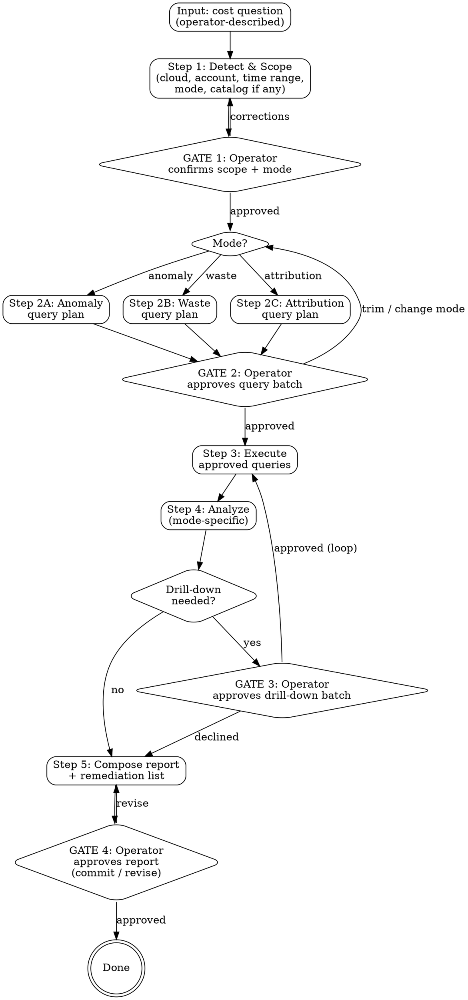

# Cloud Cost Investigate

Given a cost question, run a read-only investigation in one of three modes — **anomaly** (why did the bill change), **waste** (what are we wasting), or **attribution** (what does X cost) — and produce a report with findings and a prioritized remediation list. Strict read-only Iron Law; per-batch operator approval for queries; cloud-native APIs only.

## The Iron Law

```
NO MUTATIONS. EVER.
NO QUERY BATCH WITHOUT OPERATOR APPROVAL.
NO SAVINGS CLAIM WITHOUT A LABELLED SOURCE.
```

- Law 1: Strictly read-only. Cost APIs, resource-state APIs, metrics APIs only. No `delete`, `terminate`, `update`, `purchase` — not even "harmless" tagging fixes.
- Law 2: Every batch of cloud queries is shown to the operator and approved before execution. Per-batch (not per-query) to keep friction reasonable, but the batch is itemized with API costs and IAM permissions called out.
- Law 3: Every dollar figure in the remediation list is tagged with its source (`compute-optimizer`, `gcp-recommender`, `azure-advisor`, `line-item-computation`) and confidence (`high` / `medium` / `low`). No bare "save $X" claims.

## Guiding principles

Two principles govern how waste evidence is read and how savings are claimed. They sit above the per-mode query plans — apply them when designing the batch, when scoring confidence, and when labelling savings.

### Principle 1 — Verify activity, not attachment

Evidence of no-use measures **activity**, never **attachment**. These are different dimensions and must never be conflated:

- **Activity:** observed throughput — request / invocation / transaction counts, read or processing volume, access-log hits, query counts over a representative window.
- **Attachment:** a consumer, reference, policy, route, binding, or dependent configured against the resource. Attachment answers "what breaks if I remove this," NOT "is this being used."

Rules:
1. A dependent being enabled / connected / configured / attached is **not** evidence of use. Declared config ≠ runtime behavior. Confirm with an activity metric over a representative window.
2. The inverse holds: a resource being un-attached is **not** automatic evidence of no-use unless the resource type has no activity dimension (e.g., unattached EBS volume, unallocated Elastic IP — these cost money regardless). For anything with a usage signal (DB, queue, stream, bucket, function), require activity data.
3. **Discount keep-alive noise.** Heartbeats, health checks, warm-up schedules, monitoring probes, liveness pings, and automatic retries all produce activity that masks idleness. Their tell is a uniform, periodic, workload-independent cadence. Identify and subtract synthetic traffic before judging a resource idle.
4. Candidates whose only evidence is attachment state (or absence of it, for a resource type with an activity dimension) are capped at `confidence: low` and labelled `activity-unverified` in the report.

**Rationalization stopper:** "Something is attached / enabled, so it's in use" — and the inverse "nothing's attached, so it's waste" — both STOP. Attachment ≠ activity for any resource with a usage signal. Verify actual throughput.

### Principle 2 — Verify the cost-change direction before claiming a saving

Every savings claim involving a pricing-mode or tier change must compute the delta from **real pricing × the resource's actual utilization profile**, not from the direction of the switch. Usage-based / elastic / on-demand pricing carries a per-unit premium that can *exceed* a small fixed / reserved footprint at low utilization. The cheaper mode flips with the shape of the workload.

This applies whether the candidate came from a cloud recommender or from line-item computation. Recommender output is treated as `confidence: medium` until the math is re-checked against observed usage; bare recommender numbers without a utilization-anchored computation are not promoted to `confidence: high`.

**Rationalization stopper:** "Switching mode / tier will be cheaper" → STOP. Compute the delta from real pricing × real utilization first; the premium may run the other way.

## Constraints (Non-Negotiable)

1. **Read-only.** No mutations of any kind. Not even tagging fixes, even if they would "improve future investigations".
2. **Per-batch query approval.** No queries run before GATE 2 (initial batch) or GATE 3 (drill-down batch) approval. Skill never silently extends a batch.
3. **API costs and IAM in the plan.** Every query plan itemizes IAM permissions and (where applicable) API per-request costs. Operators must not be surprised by an unexpected bill from Cost Explorer queries.
4. **Single account by default.** Org-wide is opt-in and triggers a stricter scope confirmation. Skill never escalates from single to org silently.
5. **Catalog-or-tag for attribution mode.** Attribution mode refuses to run without either a service-discovery catalog or an operator-confirmed tag convention.
6. **Source-labelled savings claims.** Every dollar figure in the remediation list carries `source` (`compute-optimizer` / `gcp-recommender` / `azure-advisor` / `line-item-computation`) and `confidence` (`high` / `medium` / `low`). No bare claims.
7. **Cloud-native APIs only in v1.** No third-party FinOps tools. No warehouse/billing-export queries. Deferred to v2 via the `examples/` extension pattern.
8. **All output in `.culiops/cloud-cost-investigate/`.** Single directory, single file per investigation, named `<scope-slug>-<mode>-<YYYYMMDD-HHmm>.md` (service name in attribution mode; slugified account/subscription/project/cluster identifier — alias preferred, ID acceptable — in anomaly and waste modes). Same convention as other skills.
9. **Stop on query failure.** Auth errors, rate limits, service unavailability halt the investigation and surface to the operator. The skill does not silently skip and produce a partial report disguised as complete.
10. **No auto-remediation handoff.** Even if a remediation fits perfectly into `iac-change-execution`, the skill stops at the report. Operator triggers the next skill explicitly.

## Rationalization Prevention

| Thought | Reality |
|---------|---------|
| "This unattached volume has been sitting for a year — I'll just include a delete in the report" | STOP — read-only. Recommendation only, never an action. |
| "Cost Explorer charges are tiny, I don't need to surface them" | STOP — operators have hit unexpected bills from automated tooling. Itemize. |
| "Compute Optimizer says save $400 — I'll write that as the savings" | STOP — label `source: compute-optimizer, confidence: medium`. Don't strip the source. |
| "The catalog is missing — I'll attribute by guessing from naming pattern" | STOP — attribution mode requires catalog or operator-confirmed tag. Naming-pattern guessing produces wrong attributions. |
| "The operator already approved one batch, the next batch is similar, I'll just run it" | STOP — per-batch approval is non-negotiable. Drill-down is its own gate. |
| "Bill went from $50K to $80K — I'll declare ML team caused it because they always do" | STOP — driver claims need evidence in the queries run. No priors. |
| "Untagged resources are obviously waste — flag them" | STOP — untagged ≠ waste. Flag as "untagged spend, $X/mo, owner unknown" — operator decides. |
| "Nothing's attached / referenced — it's waste" | STOP — attachment ≠ activity. For any resource type with a usage signal (DB, queue, stream, bucket, function), require an activity-window check before claiming no-use. |
| "Health-check / heartbeat traffic shows hits — it's in use" | STOP — keep-alive noise has a uniform, periodic, workload-independent cadence. Identify and subtract synthetic traffic before judging activity. |
| "Switching from reserved to on-demand (or vice-versa) will save $X" | STOP — never assume direction. Compute delta from observed utilization × real pricing for both modes. The premium may run the other way at this utilization. |
| "Org-wide scope would give a better picture — I'll just go org-wide" | STOP — scope escalation requires operator opt-in. Never silent. |
| "I'll skip listing IAM permissions, the operator obviously has admin" | STOP — least-privilege is the user's expectation. Always list. |
| "This finding needs a metrics query — I'll batch it in with the original batch" | STOP — original batch is approved as-is. Drill-down is GATE 3. |

## Red Flags — STOP and Follow Process

| Red Flag | What to Do |
|----------|------------|
| About to call any non-`Get` / non-`Describe` / non-`List` API | STOP — read-only. The skill never calls write APIs. |
| Operator asks for a recommendation outside the report's source set | STOP — bring the question into the next investigation, don't fabricate. |
| Cost Explorer query count for the month already high | STOP — surface remaining quota and per-request cost; ask before proceeding. |
| Catalog references resources missing from the cost lookup (attribution mode) | Flag as "untraced", do NOT silently drop from the report. |
| Cost line items with no matching catalog resource (attribution mode) | Flag as "context cost", do NOT attribute to the service. |
| Operator asks "just summarize without showing me the queries" | STOP — query plan visibility is non-negotiable. Explain why. |
| Drill-down query batch is large (>10 queries or >$1 estimated API cost) | STOP — split into smaller batches with separate gates. |
| Resource-state query returns thousands of items | STOP — narrow scope (region, tag) and re-batch rather than dump everything. |
| Recommender returns conflicting recommendations for the same resource | STOP — present both, let operator pick. Do not pick one silently. |

## Workflow

Fixed pipeline with mode-specific middle (Steps 2 and 4 branch per mode; Steps 1, 3, and 5 are shared). One branch point at Step 2.



### Step 1 — Detect & Scope (shared)

**Inputs:** Operator's cost question (freeform).

**What the skill does:**

1. **Detect cloud(s).** Look at the working directory for cloud authentication signals (`~/.aws/`, `gcloud config`, `az account`, `kubectl config current-context`). If multiple are configured, list them and ask which to investigate. If none, ask the operator to authenticate.
2. **Detect mode from question phrasing.** Heuristic: "spike / increase / why" → anomaly; "waste / unused / idle / save" → waste; "what does X cost / breakdown / per-service" → attribution. Always confirms — never auto-runs.
3. **Set scope.** Default: the operator's currently-authenticated single account/subscription/project/cluster. If they want org-wide, they say so and the skill switches to consolidated billing / org billing account / management group / multi-cluster.
4. **Set time range.** Defaults per mode:
   - Anomaly: last 30d vs. previous 30d (or last 7d vs. previous 7d if request mentions recent).
   - Waste: current resource state + last 14d utilization metrics.
   - Attribution: previous complete billing month.
   Operator can override.
5. **Look up catalog.** Check `.culiops/service-discovery/<service>.md`. Required for attribution mode unless the operator confirms a tag convention (e.g., `Service=foo` tag). Optional for the other modes.
6. **Present scoping summary:**

> "**Cost question:** `<freeform>`
> **Mode:** anomaly / waste / attribution (suggested from phrasing)
> **Cloud:** `<aws|gcp|azure|kubernetes>`
> **Scope:** `<account/subscription/project/cluster>` (single — say `org-wide` to expand)
> **Time range:** `<from> → <to>`
> **Catalog:** `<path or 'none — using tag convention <key>' or 'none — proceeding account-wide'>`
>
> **Confirm to proceed to query planning.**"

**GATE 1.** Operator confirms or corrects.

### Step 2 — Mode-specific query plan (branch point)

The skill generates a query batch for the chosen mode. Each query is shown with: API method, scope, time range, IAM permission required, estimated API cost (e.g., AWS Cost Explorer's $0.01/req-after-100/month), and what the result will tell us.

#### Step 2A — Anomaly mode query plan

Typical batch:
1. Total spend by day, grouped by service, for the comparison window — identifies which service(s) drove the delta.
2. For top-delta services, drill-by region / usage type / linked account / tag — identifies the dimension of the change.
3. Resource-state query for newly-created resources in the anomalous window (e.g., `ec2:DescribeInstances` filtered by launch time) — identifies new resources that appeared.
4. (Optional, gated separately at Step 3) Utilization metrics for top-delta resources to confirm whether they're actually being used or just running idle.

#### Step 2B — Waste mode query plan

Typical batch:
1. **Cloud-native recommenders.** AWS Compute Optimizer rightsizing recommendations, GCP Recommender (idle VMs, unattached disks, idle IPs), Azure Advisor cost recommendations. These come pre-scored with savings estimates.
2. **Resource-state sweeps.** Unattached EBS volumes / unattached GCP disks / orphaned managed disks; orphaned snapshots older than 30d; unused Elastic IPs / unused public IPs; load balancers with no recent traffic; S3 buckets / GCS buckets / Azure containers without lifecycle policies.
3. **Untagged spend.** Cost grouped by tag presence — surfaces resources without service/owner/env tags.
4. **Utilization metrics** for instances / databases / queues / streams / functions — last 14d CPU, memory, network, request count, invocation count, throughput. **Required (not optional)** for any rightsize or idle-resource candidate per Principle 1. Resources with no activity dimension (unattached EBS, unallocated EIP, orphaned snapshots) are exempt — attachment state alone is sufficient evidence for those types.

#### Step 2C — Attribution mode query plan

Typical batch:
1. **Resolve resource list.** From catalog (preferred) or tag filter (operator-confirmed key). List of resource IDs scoped to the service.
2. **Cost lookup.** Cost Explorer / Cloud Billing filtered by resource ID set, tag, or linked account, grouped by usage type, for the time range.
3. **Period comparison.** Same window in the previous period — surfaces growth/shrink trends.
4. **Untraced cost check.** Resources in the catalog that did not appear in cost lookup (potentially mis-tagged or in a different account). Flag, don't fail.

#### Common batch presentation (all three modes)

> **Query plan for `<mode>` investigation:**
>
> | # | API | Scope | Time | IAM | Est. cost | Why |
> |---|-----|-------|------|-----|-----------|-----|
> | 1 | `ce:GetCostAndUsage` | `<acct>` | last 30d | `ce:GetCostAndUsage` | $0.01 | total spend by service |
> | 2 | ... | ... | ... | ... | ... | ... |
>
> **Total estimated API cost:** $0.0X
> **IAM permissions needed:** `<consolidated list>`
>
> **Approve this batch?** (approve / trim / change mode)

**GATE 2.** Operator approves, trims (drops specific queries), or changes mode (loops back to Step 1's mode confirmation).

### Step 3 — Execute approved queries (shared mechanics)

Run the approved batch. Each query's raw output captured to a buffer for the report. If a query fails (auth, rate limit, service unavailable), skill stops and reports the failure — does not silently skip. The buffer is the verbatim raw output retained for the report's `## Queries run` section, so the operator can audit exactly what was fetched.

### Step 4 — Analyze (mode-specific)

#### Step 4A — Anomaly analysis

- Compute period delta totals.
- Decompose delta by dimension: service → region / usage type / account / tag.
- Match new-resource list against top-delta services to identify likely drivers.
- Rank drivers by absolute delta dollars (not percentage — a 50% increase on a $5 line item is noise).
- Output: ranked list of `(driver, delta, dimensions, candidate explanation)`.

#### Step 4B — Waste analysis

- Merge cloud recommender output with resource-state sweep findings (deduplicate — Compute Optimizer may already cover what we'd compute manually).
- For each candidate: estimated monthly savings (from recommender or computed from line item), source label, confidence.
- **Apply Principle 1 confidence cap.** Any candidate whose only no-use evidence is attachment state (and whose resource type has an activity dimension — DB, queue, stream, bucket, function) is capped at `confidence: low` and labelled `activity-unverified` in the Evidence column. Operator may approve a drill-down batch at GATE 3 to fetch the missing activity data and promote confidence.
- **Apply Principle 2 cost-direction check.** Any candidate whose savings come from a pricing-mode / tier change (reserved ↔ on-demand, provisioned ↔ serverless, hot ↔ cold storage tier) must include a delta computed from observed utilization × real pricing for both modes. Without that math, cap at `confidence: low` and label `direction-unverified`.
- Filter: drop candidates below a threshold (default $5/mo) to reduce noise; operator can adjust at GATE 4.
- Group by remediation type: delete / rightsize / archive / lifecycle-policy / tag.
- Output: prioritized waste list with per-candidate evidence.

#### Step 4C — Attribution analysis

- Sum cost by resource → roll up by usage type → roll up to service total.
- Compare to prior period: trend (%/$) and direction.
- Flag untraced resources from catalog that didn't show up.
- Flag cost line items that didn't match any catalog resource (potentially shared infra cost, or mis-tagged) — these become "context" not "service cost".
- Output: per-service breakdown with usage-type drill-downs, trend, and untraced/context flags.

#### Drill-down decision

After analysis, the skill checks: did any finding need a query we didn't run (e.g., anomaly identified a service but no resource detail; waste flagged an instance but no utilization data fetched)? If yes, propose a follow-up batch.

**GATE 3.** Operator approves the follow-up batch, declines (skill proceeds to report with the gap noted), or requests a different drill-down.

### Step 5 — Compose report + remediation list (shared)

Write to `.culiops/cloud-cost-investigate/<scope-slug>-<mode>-<YYYYMMDD-HHmm>.md`. The `<scope-slug>` is the service name in attribution mode and the slugified account/subscription/project/cluster identifier — alias preferred, ID acceptable — in anomaly and waste modes:

````markdown
**Cloud cost investigation**
**Mode:** anomaly | waste | attribution
**Scope:** <account/subscription/project/cluster> (single | org-wide)
**Time range:** <from> → <to>
**Catalog used:** <path or 'none'>
**Date:** <YYYY-MM-DD HH:mm>
**Cloud:** <aws|gcp|azure|kubernetes>

## Question
<operator's question, verbatim>

## Scoping decisions
<what was confirmed at GATE 1 — scope, time range, mode>

## Queries run
<table — same shape as the GATE 2 plan, with status per query>

## Findings
<mode-specific section>

## Remediation list (prioritized)
| # | Action | Resource(s) | Est. savings | Source | Confidence | Evidence |
|---|--------|-------------|--------------|--------|------------|----------|
| 1 | Delete unattached EBS volume | vol-xxxxx | $48/mo | line-item-computation | high | volume.state=available since 2026-02-14 |
| 2 | Rightsize prod-api from m5.4xl → m5.2xl | i-yyyyy | $280/mo | compute-optimizer | medium | CO recommendation, 14d avg CPU 4% |
| ... | ... | ... | ... | ... | ... | ... |

**Total estimated savings:** $X/mo (sum of high-confidence) + $Y/mo (medium) + $Z/mo (low)

## Untraced / context (attribution mode only)
<resources in catalog with no cost / cost lines with no catalog match>

## Gaps
<things the skill couldn't answer with the queries run, e.g., "did not fetch CloudWatch metrics — operator declined drill-down">

## Next steps (informational)
<suggestions for the operator: which findings to investigate further, which to act on via iac-change-execution>
````

> "Report drafted at `<path>`. Review it. Approve to commit, or tell me what to revise."

**GATE 4.** Operator reviews, requests revisions, or approves. On approve, skill commits the report file (only the report — no other changes).

## Model Routing

> These hints guide the orchestrating model on which model tier to use per step. **Rules:** (1) Production-conservative — only route to sonnet when a gate catches errors or the step is purely mechanical. (2) Escalate to opus if a sonnet subagent returns uncertain results. (3) The orchestrator may override any hint based on runtime complexity.

| Step | Model | Inputs | Outputs | Rationale |
|------|-------|--------|---------|-----------|
| Step 1: Detect & scope | sonnet | Operator question, working dir auth signals, catalog presence | Scoping summary | Pattern matching on auth files and catalog. Mode suggestion is a heuristic — operator confirms |
| Step 2: Query plan | opus | Mode, scope, time range, catalog | Itemized query batch with IAM + API cost | Wrong query plan wastes operator time and Cost Explorer budget. Needs to be precise per cloud |
| Step 3: Execute queries | sonnet | Approved batch | Raw results buffer | Mechanical CLI/SDK execution. Operator approved each item |
| Step 4: Analyze (anomaly) | opus | Cost time series, resource creation events | Ranked driver list with explanations | Causal reasoning under uncertainty — easy to over-claim. Wants conservative, evidence-anchored output |
| Step 4: Analyze (waste) | opus | Recommender output, resource state, utilization | Prioritized waste list with sources/confidence | Combining recommender + computed sources is judgment-heavy. Confidence labelling matters |
| Step 4: Analyze (attribution) | sonnet | Cost lookups, catalog resource list | Per-service breakdown | Mostly aggregation and roll-up. Untraced/context flagging is mechanical |
| Step 5: Compose report | sonnet | All buffered outputs from prior steps | `.culiops/cloud-cost-investigate/` record | Template assembly from validated content. All findings already produced at Step 4 |

**Estimated split:** ~45% opus (Steps 2, 4 anomaly/waste), ~55% sonnet (Steps 1, 3, 4 attribution, 5).

## Integration with Other Skills

```
service-discovery ──catalog──→ cloud-cost-investigate
                                       │
                                       ↓
                          .culiops/cloud-cost-investigate/ record
                                       │
                                       ↓ (operator-driven, no auto-handoff)
                          iac-change-execution (separate invocation)
```

- **Consumes from `service-discovery`:** Catalog used as a service→resource mapping in attribution mode (required); used as supporting context in anomaly/waste (optional).
- **Does not invoke `pre-flight`:** Investigation is read-only — no apply, no risk gate needed.
- **Does not feed `iac-change-execution` automatically:** Remediation list is the artifact. Operator picks an action and triggers `iac-change-execution` separately if they want to implement it.
- **No dependency on future skills** (`incident-investigation`, etc.). No circular dependencies.
