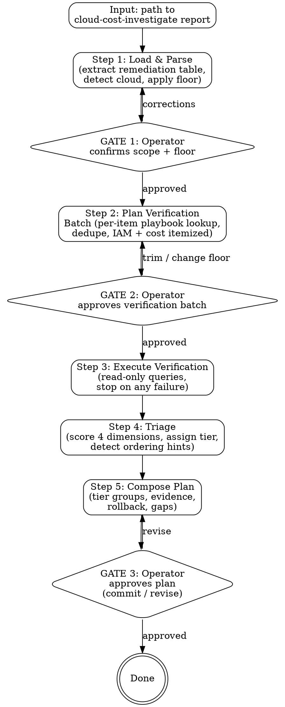

# Cost Optimize Plan

Given a `cloud-cost-investigate` report, run a read-only per-action verification pass, triage each remediation across four dimensions (reversibility, blast radius, evidence of no-use, dependency footprint), and produce a tiered execution plan. Strict read-only Iron Law; per-batch operator approval for verification queries; no handoff to execution — operator drives `iac-change-execution` manually with the plan.

## The Iron Law

```
NO MUTATIONS. EVER.
NO VERIFICATION QUERIES WITHOUT OPERATOR APPROVAL.
NO TIER ASSIGNMENT WITHOUT EVIDENCE.
NO HANDOFF TO EXECUTION — OPERATOR DRIVES.
```

- **Law 1: Read-only.** Cost APIs, resource-state APIs, metrics APIs, access-log queries only. No `delete` / `terminate` / `update` / `tag` — not even "harmless" ones.
- **Law 2: Per-batch verification approval.** All verification queries for the report are planned together, itemized with IAM perms + per-query API cost, and approved as one batch before any run.
- **Law 3: Every tier assignment carries evidence.** No item lands in 🟢 or 🚫 without a labelled signal — the verification result row points at the specific query and its output. Same discipline as `cloud-cost-investigate`'s source-labelled savings.
- **Law 4: Skill stops at the plan.** Even when an item is 🟢 Fast win and the operator says "just run it" — the skill refuses. Operator opens `iac-change-execution` separately. Avoids skipping the per-change `pre-flight` gate.

## Constraints (Non-Negotiable)

1. **Read-only.** No mutations of any kind.
2. **Per-batch query approval.** All verification queries pass GATE 2 as a single batch with IAM + cost itemization. No silent extensions.
3. **No playbook → manual review.** Items whose `(cloud, action-type, resource-type)` has no `examples/<cloud>/<action>.md` playbook are marked `manual-review-required` and parked in a dedicated section of the plan. Skill never invents a verification strategy on the fly.
4. **Evidence required for every tier.** No 🟢 / 🚫 without a verification signal. If a query failed, the item stays in 🔴 with `verification-incomplete` evidence — never silently promoted.
5. **Single report per run.** Skill runs against one `cloud-cost-investigate` report at a time. Combining reports across accounts / time ranges is out of scope.
6. **Catalog re-use, not re-fetch.** Service-discovery catalog is consulted (if present) for dependency lookup — never re-discovered.
7. **Output: `.culiops/cost-optimize-plan/<scope-slug>-<YYYYMMDD-HHmm>.md`.** Scope-slug matches the upstream report's slug, so plan files line up next to the investigation they triage.
8. **Stop on query failure.** Auth errors, rate limits, throttling halt the run and surface to operator. The skill does not silently skip and produce a partial plan disguised as complete.
9. **No re-evaluation of savings.** Upstream report's savings/source/confidence are copied verbatim into the plan. This skill adds safety/triage columns alongside.
10. **No handoff automation.** Plan ends at GATE 3 commit. Even a single fast-win item does not trigger `iac-change-execution` automatically.

## Rationalization Prevention

| Thought | Reality |
|---------|---------|
| "Item is obviously safe, I'll skip its verification query" | STOP — every actionable item gets verification. |
| "No playbook, but I know what to check for this type" | STOP — mark `manual-review-required`. Codify the playbook first, then ship. |
| "Verification failed for that one query, but the others passed — call it 🟢" | STOP — incomplete evidence = 🔴, not 🟢. |
| "Operator wants to chain straight into iac-change-execution" | STOP — plan terminus is the gate. |
| "Upstream report's savings number looks wrong, I'll recompute" | STOP — that's `cloud-cost-investigate`'s job. Flag and stop. |
| "Operator says they know that S3 bucket is dead, skip the CloudTrail check" | STOP — operator certainty is not evidence. Run the query or park as manual-review-required. |
| "Catalog is missing for this account — score Dependency dimension as 🟢 (no consumers found = no consumers exist)" | STOP — missing catalog ≠ no dependencies. Score as ⚪ and bump tier conservatively. |

## Red Flags — STOP and Follow Process

| Red Flag | What to Do |
|----------|------------|
| About to call any non-`Get`/`Describe`/`List`/`Lookup`/`Simulate` API | STOP — read-only. The skill never calls write APIs. |
| Upstream report has no `Remediation list` table | STOP — abort at GATE 1 with `report-format-invalid`. |
| An item's `(cloud, action, resource_type)` has no matching playbook in `examples/<cloud>/` | Park in `❔ Manual review required` section. Do NOT invent verification queries. |
| Verification query returns rate-limited / throttled | STOP the batch; surface to operator. No partial plan. |
| Operator says "skip verification on item #N — I know it's safe" | STOP — verification is per-batch and applies to all actionable items. Operator can drop the item from scope, not skip its verification. |
| 🚫 Tier triggered (evidence of use found) | Item stays in plan but in `🚫 Do not act` section. Do NOT silently drop. |
| Upstream report's savings number looks wrong | STOP — out of scope. Flag in `Gaps` section and continue. |
| Operator asks to chain directly into `iac-change-execution` | STOP — plan terminus is GATE 3. Operator opens execution skill manually. |
| Multi-cloud upstream report (multiple `**Cloud:**` headers) | STOP — abort at GATE 1 with `multi-cloud-report-unsupported`. |

## Workflow

Fixed pipeline with three operator gates. Mirrors `cloud-cost-investigate`'s shape (scope → batch → review) with one fewer gate — no drill-down loop because verification is a single batch by design.



### Step 1 — Load & Parse (shared)

Read the upstream report and establish scope.

1. Read upstream report file (operator provides path).
2. Parse the `## Remediation list (prioritized)` table → list of items.
3. Read header for `**Cloud:**` (single-cloud required), `**Scope:**`, time-range, mode.
4. Look up catalog: `.culiops/service-discovery/` directory (optional). If present, parse for dependency lookup later.
5. Apply optional savings floor (default $5/mo, matching upstream). Items below the floor go to a "filtered (below floor)" appendix in the plan.
6. Present scoping summary to operator (see GATE 1 below).

### GATE 1 — Scope

Operator confirms or corrects.

> **Cost optimization plan scoping summary:**
>
> **Upstream report:** `<path>`
> **Mode:** waste | anomaly | attribution (from upstream)
> **Cloud:** aws (single — mixed-cloud upstream reports are unsupported and abort with `multi-cloud-report-unsupported`)
> **Scope:** `<account/subscription/project/cluster>`
> **Time range:** `<from> → <to>`
> **Catalog:** `<.culiops/service-discovery/ path or 'none — Dimension 4 conservative scoring'>`
> **Items considered:** N (above $X/mo floor) / M filtered (below floor)
>
> **Confirm to proceed to verification planning.**

### Step 2 — Plan Verification Batch

For each item, look up playbook by `(cloud, action, resource_type)`. Derive `action` from the upstream remediation's verb (e.g., "Delete unattached EBS volume" → action=delete) and `resource_type` from resource ID format (e.g., `vol-*` → ebs-volume).

Items with no matching playbook go to `manual-review-required` queue (skipped from the batch, surfaced in final plan).

For items with a matching playbook: collect required queries, dedupe across items (e.g., shared route53 sweep), aggregate IAM perms list, sum estimated API costs.

Present batch as:

| # | Item | API | Scope | IAM | Est. cost | Why |
|---|------|-----|-------|-----|-----------|-----|
| 1 | Delete vol-xxxxx | ec2:DescribeVolumes | vol-xxxxx | ec2:Describe* | $0 | confirm state=available, age |
| 2 | Delete logs-2019 | cloudtrail:LookupEvents | logs-2019, 90d | cloudtrail:LookupEvents | $1.20 | confirm no GetObject/PutObject |
| ... | ... | ... | ... | ... | ... | ... |

Plus footer with total API cost, consolidated IAM perms list, manual-review count.

### GATE 2 — Verification batch

Operator approves, trims (drops specific queries or items), or changes the savings floor (loops back to Step 1).

If batch is empty (e.g., all items routed to manual-review), skill skips Step 3 and goes straight to compose-plan with a manual-review-only output. Note: this case is non-zero — fixture `no-playbook` exercises it.

### Step 3 — Execute Verification (shared mechanics)

Run the approved batch. Each query's raw output captured for the plan's `## Verification queries run` section. If a query fails (auth, rate limit, service unavailable), skill stops and reports — does NOT silently skip and does NOT auto-retry. Surfaces to operator with the failure reason and a suggested fix (e.g., "grant `cloudtrail:LookupEvents` and re-run, or trim item #N from batch").

### Step 4 — Triage

For each item, score the 4 dimensions per the rules in `## Triage Model` (Section to be added in Task 8 — at this point, the reader will see a forward reference; acceptable). Tier assignment is deterministic (no LLM judgment in the rule).

Detect ordering hints mechanically:
- **Snapshot-before-delete:** if an item is a delete-EBS or delete-EC2 and playbook recommends snapshotting first, emit a hint.
- **Same-resource conflict:** if two items target the same resource, emit "do #X before #Y".
- **Catalog dependency edges:** if item N deletes resource R, and another item M operates on a resource depending on R per catalog, emit "do #M before #N".

### Step 5 — Compose Plan

Render the markdown using the output template (Section "Output Format" to be added in Task 8). Write to `.culiops/cost-optimize-plan/<scope-slug>-<YYYYMMDD-HHmm>.md` only AFTER GATE 3 approval.

### GATE 3 — Plan review

Operator reviews drafted plan, approves to commit, or requests revisions (e.g., "bump item #5 from 🟡 to 🔴 — that EIP is allowlisted in our partner's firewall, recreating loses the IP"). On approve, skill commits the plan file (only the plan — no other changes).
