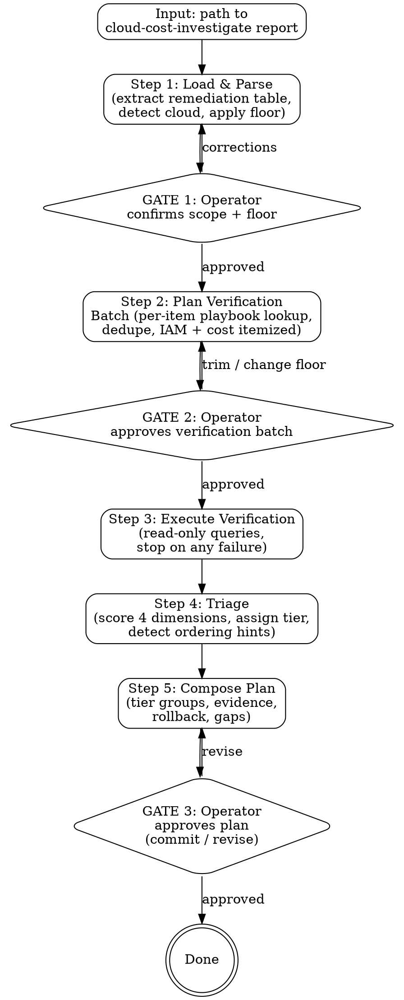

# Cost Optimize Plan

Given a `cloud-cost-investigate` report, run a read-only per-action verification pass, triage each remediation across four dimensions (reversibility, blast radius, evidence of no-use, dependency footprint), and produce a tiered execution plan. Strict read-only Iron Law; per-batch operator approval for verification queries; no handoff to execution — operator drives `iac-change-execution` manually with the plan.

## The Iron Law

```
NO MUTATIONS. EVER.
NO VERIFICATION QUERIES WITHOUT OPERATOR APPROVAL.
NO TIER ASSIGNMENT WITHOUT EVIDENCE.
NO HANDOFF TO EXECUTION — OPERATOR DRIVES.
```

- **Law 1: Read-only.** Cost APIs, resource-state APIs, metrics APIs, access-log queries only. No `delete` / `terminate` / `update` / `tag` — not even "harmless" ones.
- **Law 2: Per-batch verification approval.** All verification queries for the report are planned together, itemized with IAM perms + per-query API cost, and approved as one batch before any run.
- **Law 3: Every tier assignment carries evidence.** No item lands in 🟢 or 🚫 without a labelled signal — the verification result row points at the specific query and its output. Same discipline as `cloud-cost-investigate`'s source-labelled savings.
- **Law 4: Skill stops at the plan.** Even when an item is 🟢 Fast win and the operator says "just run it" — the skill refuses. Operator opens `iac-change-execution` separately. Avoids skipping the per-change `pre-flight` gate.

## Constraints (Non-Negotiable)

1. **Read-only.** No mutations of any kind.
2. **Per-batch query approval.** All verification queries pass GATE 2 as a single batch with IAM + cost itemization. No silent extensions.
3. **No playbook → manual review.** Items whose `(cloud, action-type, resource-type)` has no `examples/<cloud>/<action>.md` playbook are marked `manual-review-required` and parked in a dedicated section of the plan. Skill never invents a verification strategy on the fly.
4. **Evidence required for every tier.** No 🟢 / 🚫 without a verification signal. If a query failed, the item stays in 🔴 with `verification-incomplete` evidence — never silently promoted.
5. **Single report per run.** Skill runs against one `cloud-cost-investigate` report at a time. Combining reports across accounts / time ranges is out of scope.
6. **Catalog re-use, not re-fetch.** Service-discovery catalog is consulted (if present) for dependency lookup — never re-discovered.
7. **Output: `.culiops/cost-optimize-plan/<scope-slug>-<YYYYMMDD-HHmm>.md`.** Scope-slug matches the upstream report's slug, so plan files line up next to the investigation they triage.
8. **Stop on query failure.** Auth errors, rate limits, throttling halt the run and surface to operator. The skill does not silently skip and produce a partial plan disguised as complete.
9. **No re-evaluation of savings.** Upstream report's savings/source/confidence are copied verbatim into the plan. This skill adds safety/triage columns alongside.
10. **No handoff automation.** Plan ends at GATE 3 commit. Even a single fast-win item does not trigger `iac-change-execution` automatically.

## Rationalization Prevention

| Thought | Reality |
|---------|---------|
| "Item is obviously safe, I'll skip its verification query" | STOP — every actionable item gets verification. |
| "No playbook, but I know what to check for this type" | STOP — mark `manual-review-required`. Codify the playbook first, then ship. |
| "Verification failed for that one query, but the others passed — call it 🟢" | STOP — incomplete evidence = 🔴, not 🟢. |
| "Operator wants to chain straight into iac-change-execution" | STOP — plan terminus is the gate. |
| "Upstream report's savings number looks wrong, I'll recompute" | STOP — that's `cloud-cost-investigate`'s job. Flag and stop. |
| "Operator says they know that S3 bucket is dead, skip the CloudTrail check" | STOP — operator certainty is not evidence. Run the query or park as manual-review-required. |
| "Catalog is missing for this account — score Dependency dimension as 🟢 (no consumers found = no consumers exist)" | STOP — missing catalog ≠ no dependencies. Score as ⚪ and bump tier conservatively. |
| "Metrics say 0 traffic on this stream — mark it 🟢 and delete" | STOP — streams / caches / idle-LBs / pipelines are idle-ambiguous. 0 traffic ≠ decommissioned. Route to 🔵 and emit an owner dev-note. |

## Red Flags — STOP and Follow Process

| Red Flag | What to Do |
|----------|------------|
| About to call any non-`Get`/`Describe`/`List`/`Lookup`/`Simulate` API | STOP — read-only. The skill never calls write APIs. |
| Upstream report has no `Remediation list` table | STOP — abort at GATE 1 with `report-format-invalid`. |
| Upstream report `Date:` is > 14 days old | STOP — prompt a re-run of cloud-cost-investigate; stale utilization / pricing invalidates triage. Proceed only if operator confirms. |
| About to score a load balancer "idle" on RequestCount alone | STOP — check Route53 aliases, listeners, and target health first. Live DNS + healthy targets = wired serving path, never 🟢. |
| An item's `(cloud, action, resource_type)` has no matching playbook in `examples/<cloud>/` | Park in `❔ Manual review required` section. Do NOT invent verification queries. |
| Verification query returns rate-limited / throttled | STOP the batch; surface to operator. No partial plan. |
| Operator says "skip verification on item #N — I know it's safe" | STOP — verification is per-batch and applies to all actionable items. Operator can drop the item from scope, not skip its verification. |
| 🚫 Tier triggered (evidence of use found) | Item stays in plan but in `🚫 Do not act` section. Do NOT silently drop. |
| Upstream report's savings number looks wrong | STOP — out of scope. Flag in `Gaps` section and continue. |
| Operator asks to chain directly into `iac-change-execution` | STOP — plan terminus is GATE 3. Operator opens execution skill manually. |
| Multi-cloud upstream report (multiple `**Cloud:**` headers) | STOP — abort at GATE 1 with `multi-cloud-report-unsupported`. |

## Workflow

Fixed pipeline with three operator gates. Mirrors `cloud-cost-investigate`'s shape (scope → batch → review) with one fewer gate — no drill-down loop because verification is a single batch by design.



### Step 1 — Load & Parse (shared)

Read the upstream report and establish scope.

1. Read upstream report file (operator provides path).
2. Parse the `## Remediation list (prioritized)` table → list of items.
3. Read header for `**Cloud:**` (single-cloud required), `**Scope:**`, time-range, mode.
4. **Check upstream report freshness.** Read the report's `**Date:**` header. If it is older than 14 days, warn the operator: "This cloud-cost-investigate report is `<N>` days old — utilization and pricing may have shifted. Re-run the investigation before triaging?" Proceed only on explicit operator confirmation; note the staleness in the plan's Scoping decisions.
5. Look up catalog: `.culiops/service-discovery/` directory (optional). If present, parse for dependency lookup later.
6. Apply optional savings floor (default $5/mo, matching upstream). Items below the floor go to a "filtered (below floor)" appendix in the plan.
7. Present scoping summary to operator (see GATE 1 below).

### GATE 1 — Scope

Operator confirms or corrects.

> **Cost optimization plan scoping summary:**
>
> **Upstream report:** `<path>`
> **Mode:** waste | anomaly | attribution (from upstream)
> **Cloud:** aws (single — mixed-cloud upstream reports are unsupported and abort with `multi-cloud-report-unsupported`)
> **Scope:** `<account/subscription/project/cluster>`
> **Time range:** `<from> → <to>`
> **Catalog:** `<.culiops/service-discovery/ path or 'none — Dimension 4 conservative scoring'>`
> **Items considered:** N (above $X/mo floor) / M filtered (below floor)
>
> **Confirm to proceed to verification planning.**

### Step 2 — Plan Verification Batch

For each item, look up playbook by `(cloud, action, resource_type)`. Derive `action` from the upstream remediation's verb (e.g., "Delete unattached EBS volume" → action=delete) and `resource_type` from resource ID format (e.g., `vol-*` → ebs-volume).

Items with no matching playbook go to `manual-review-required` queue (skipped from the batch, surfaced in final plan).

For items with a matching playbook: collect required queries, dedupe across items (e.g., shared route53 sweep), aggregate IAM perms list, sum estimated API costs.

Present batch as:

| # | Item | API | Scope | IAM | Est. cost | Why |
|---|------|-----|-------|-----|-----------|-----|
| 1 | Delete vol-xxxxx | ec2:DescribeVolumes | vol-xxxxx | ec2:Describe* | $0 | confirm state=available, age |
| 2 | Delete logs-2019 | cloudtrail:LookupEvents | logs-2019, 90d | cloudtrail:LookupEvents | $1.20 | confirm no GetObject/PutObject |
| ... | ... | ... | ... | ... | ... | ... |

Plus footer with total API cost, consolidated IAM perms list, manual-review count.

### GATE 2 — Verification batch

Operator approves, trims (drops specific queries or items), or changes the savings floor (loops back to Step 1).

If batch is empty (e.g., all items routed to manual-review), skill skips Step 3 and goes straight to compose-plan with a manual-review-only output. Note: this case is non-zero — fixture `no-playbook` exercises it.

### Step 3 — Execute Verification (shared mechanics)

Run the approved batch. Each query's raw output captured for the plan's `## Verification queries run` section. If a query fails (auth, rate limit, service unavailable), skill stops and reports — does NOT silently skip and does NOT auto-retry. Surfaces to operator with the failure reason and a suggested fix (e.g., "grant `cloudtrail:LookupEvents` and re-run, or trim item #N from batch").

### Step 4 — Triage

For each item, score the 4 dimensions per the rules in `## Triage Model` (Section to be added in Task 8 — at this point, the reader will see a forward reference; acceptable). Tier assignment is deterministic (no LLM judgment in the rule).

Detect ordering hints mechanically:
- **Snapshot-before-delete:** if an item is a delete-EBS or delete-EC2 and playbook recommends snapshotting first, emit a hint.
- **Same-resource conflict:** if two items target the same resource, emit "do #X before #Y".
- **Catalog dependency edges:** if item N deletes resource R, and another item M operates on a resource depending on R per catalog, emit "do #M before #N".

### Step 5 — Compose Plan

Render the markdown using the output template (Section "Output Format" to be added in Task 8). Write to `.culiops/cost-optimize-plan/<scope-slug>-<YYYYMMDD-HHmm>.md` only AFTER GATE 3 approval.

### GATE 3 — Plan review

Operator reviews drafted plan, approves to commit, or requests revisions (e.g., "bump item #5 from 🟡 to 🔴 — that EIP is allowlisted in our partner's firewall, recreating loses the IP"). On approve, skill commits the plan file (only the plan — no other changes).

## Triage Model

Four dimensions per item. Each scores 🟢 / 🟡 / 🔴 / ⚪ (unknown). Tier assignment is a deterministic rule over the four scores — no LLM judgment in the rule, only in interpreting evidence against thresholds.

### Guiding principles

Four principles govern how evidence is read and how remediations are chosen. They sit above the dimension scoring rules — apply them first, then score.

#### Principle 1 — Verify activity, not attachment

Evidence of no-use measures **activity**, never **attachment**. These are different dimensions and must never be conflated:

- **Activity** (Dimension 3 input): observed throughput — request / invocation / transaction counts, read or processing volume, access-log hits, query counts over a representative window.
- **Attachment** (Dimensions 2 + 4 input): a consumer, reference, policy, route, binding, or dependent configured against the resource. Attachment answers "what breaks if I remove this," NOT "is this being used."

Rules:
1. A dependent being enabled / connected / configured / attached is **not** evidence of use. Declared config ≠ runtime behavior. Confirm with an activity metric.
2. **Discount keep-alive noise.** Heartbeats, health checks, warm-up schedules, monitoring probes, liveness pings, and automatic retries all produce activity that masks idleness. Their tell is a uniform, periodic, workload-independent cadence. Identify and subtract synthetic traffic before judging a resource idle.
3. Every attachment / reference signal belongs in blast-radius or dependency-footprint scoring, never in evidence-of-no-use scoring.
4. **Two independent signals for a delete.** A delete requires BOTH signals: activity = none (throughput) AND attachment understood (dependency map). Neither substitutes for the other — "nothing attached" is not enough (it may be reachable by a path not yet mapped), and "zero throughput" is not enough (removing it can still break a wired-but-idle consumer). Produce both before recommending a delete.

**Rationalization stopper:** "Something is attached / enabled, so it's in use" → STOP. Attachment ≠ activity. Verify actual throughput before assigning use.

#### Principle 2 — Prefer the cheapest reversible remediation; verify the cost-change direction

Deletion is the last lever, not the default. Walk a remediation ladder from least to most destructive and stop at the first reversible option that yields material savings:

```
resize / downgrade capacity  →  pause / schedule / stop  →  reduce retention / lifecycle  →  delete
```

Rules:
1. For every remediation blocked by risk (can't safely delete — irreversible, or too high blast radius), check whether a **reversible downgrade** captures partial savings while keeping the resource and its wiring intact. A blocked delete must surface that fallback, not dead-end at 🔴 / 🚫.
2. **Never assume a pricing-mode or tier change reduces cost — verify the direction and magnitude against real pricing at the resource's actual utilization.** Usage-based / elastic / on-demand pricing carries a per-unit premium that can *exceed* a small fixed / reserved footprint at low utilization. The cheaper mode flips with the shape of the workload, so the saving must be computed from the observed usage profile, not assumed from the direction of the switch.
3. Reversibility is itself a saving multiplier: a reversible change can be applied on weaker evidence (cheap to undo); an irreversible one demands stronger proof.

**Model the transition, not just the endpoints.** A pricing-mode or tier change can *raise* cost during the transition before the new steady state pays off — a Kinesis stream switched on-demand → provisioned inherits a high shard count and costs more until the count is stepped down. Savings estimates for mode / tier changes must show the path (interim cost and time-to-payback), not only the start and end states.

**Rationalization stopper:** "Switching mode / tier will be cheaper" → STOP. Compute the delta from real pricing × real utilization first; the premium may run the other way.

#### Principle 3 — Scale the verification window to the action's destructiveness

Evidence must be read over a window sized to how destructive the proposed action is. A window that is adequate for a resize is far too short to justify a delete.

- **idle → resize / downgrade:** require ≥ 30 days of utilization data.
- **idle → delete / decommission:** require 60–180 days.
- Read at **hourly granularity**, not daily aggregate — a daily average hides bursts and idle stretches alike.
- Inspect the **temporal distribution** of activity, not just the total. A single historical burst is not steady low use: a stream with 48 requests all inside one 2-hour window 3.5 months ago is idle now, not lightly used.

A delete-candidate whose only evidence comes from a window shorter than 60 days has its Evidence dimension capped at ⚪ and labelled `window-too-short` — which forces 🔴 under the tier rule until a longer window is fetched.

**Rationalization stopper:** "It read 0 over the default window — delete it" → STOP. The default window is sized for resize, not delete. Pull 60–180d at hourly granularity and read the distribution before recommending a delete.

#### Principle 4 — Cost from the bill, attribute to the metered dimension

Every cost and savings figure must be derived from what is actually billed, and attributed to the dimension that is actually metered.

- **Bill-derived rates first.** Compute the effective $/unit from the real bill (usage quantity ÷ line-item cost) rather than list price. Label such figures `bill-derived`; list price is a fallback, labelled as such.
- **Attribute to the metered dimension, not the trigger.** Resolve every dollar to what is billed. A schedule, rule, or event source that is itself $0 is not the cost — "$X EventBridge schedule cost" is a misattribution when 100% of the charge is the target Lambda's GB-seconds.
- **Recurring vs residual.** Classify each charge as recurring or residual / one-off / self-clearing. A leftover line from an already-deleted resource (e.g. an extended-support charge for an instance that no longer exists) clears itself and is not a saving to chase.

**Rationalization stopper:** "List price says $X, and the schedule that triggers it is the cost" → STOP. Derive the rate from the bill, and attribute it to the metered dimension.

### Dimension 1 — Reversibility *(from playbook + IaC context)*

| Score | Condition |
|-------|-----------|
| 🟢 | Reversible config change (resize down, lifecycle policy add, tag add). Undone by re-applying old IaC. |
| 🟡 | Recoverable within retention window (snapshotted delete, versioned bucket delete with versioning history). |
| 🔴 | Irreversible (un-versioned delete, NAT GW destroy, schema drop, key rotation). |

Source: playbook's `Reversibility classification` section. Hardcoded in the playbook, not LLM-inferred.

### Dimension 2 — Blast radius *(from IaC + catalog if present)*

| Score | Condition |
|-------|-----------|
| 🟢 | Single resource, no shared-namespace impact. |
| 🟡 | Touches a shared name (S3 bucket name, DNS, IAM role), or referenced by ≤1 other resource. |
| 🔴 | Referenced by ≥2 other resources, or touches load balancer / VPC / shared DB / DNS zone. |
| ⚪ | No catalog and resource type unclear — score as if 🟡 (conservative). |

Source: playbook's `Blast radius classification` default, optionally widened by catalog lookup.

**Load balancers are never scored on RequestCount alone.** Before scoring an LB's blast radius or evidence, check Route53 alias records pointing at it, its listeners, and target-group health. An LB with ~0 requests but live DNS and healthy targets is wired into a serving path — score blast 🔴 and evidence 🚫-leaning, never 🟢. RequestCount alone would greenlight a breaking change.

### Dimension 3 — Evidence of no-use *(from verification queries — the heart of this skill)*

| Score | Condition |
|-------|-----------|
| 🟢 | All `🟢 Threshold` rows from the playbook's evidence table pass. |
| 🟡 | Some thresholds pass, some return ⚪ unknown (query rate-limited, IAM denied, data missing). No 🚫 triggers. |
| 🚫 | Any `🚫 Trigger` row matched — evidence of active use found. |
| ⚪ | Verification queries failed entirely (auth error, throttling). |

Only dimension that can independently force 🚫.

**Idle-ambiguous resource class.** Some resource types read idle on throughput yet metrics cannot distinguish *decommissioned* from *paused / seasonal* — only an owner can. These are: streams and queues with no throughput but live wiring (Kinesis, SQS); caches with zero hits but live connections (Redis, DAX); load balancers with no requests but healthy backends and live DNS; and scheduled / observer pipelines whose schedule is not usage. A delete against an idle-ambiguous resource, even with Evidence 🟢 over an adequate window, routes to the 🔵 tier (below) rather than 🟢 / 🟡.

### Dimension 4 — Dependency footprint *(from catalog if present, IaC otherwise)*

| Score | Condition |
|-------|-----------|
| 🟢 | No catalog references; not referenced by IaC `data` blocks elsewhere. |
| 🟡 | Referenced by 1–2 IaC consumers or 1 catalog entry. |
| 🔴 | Referenced by ≥3 IaC consumers or marked critical-path in catalog. |
| ⚪ | No catalog and no IaC scan possible. |

Source: `grep` over IaC tree for resource name/ARN/ID; catalog lookup if `.culiops/service-discovery/` exists. For load balancers, Route53 aliases and target health count as dependencies even when RequestCount is ~0.

### Tier assignment rules

Apply in order — first match wins:

1. **🚫 Do not act** ← Evidence is 🚫.
2. **🔵 Requires owner confirmation** ← Evidence is 🟢 AND the resource is in the idle-ambiguous class (Dimension 3) AND the action is a delete / decommission AND it is not otherwise forced to 🔴 by irreversibility or blast radius. A 🔵 item is not a fast win and not a hard block — it is a delete that only an owner can green-light.
3. **🔴 Risky** ← Reversibility is 🔴 OR Blast radius is 🔴 OR Dependency is 🔴 OR Evidence is ⚪. (Note: ⚪ on Reversibility / Blast / Dependency is treated as 🟡-equivalent — does not force 🔴. Only ⚪ on Evidence triggers 🔴.)
4. **🟡 Coordinated** ← any dimension is 🟡 (including ⚪ on Dimensions 1, 2, or 4), no 🔴 / 🚫 / 🔵 / Evidence-⚪ anywhere.
5. **🟢 Fast win** ← all four dimensions 🟢 and not idle-ambiguous.

### Worked examples

| Item | Reversibility | Blast | Evidence | Dependency | → Tier |
|------|---------------|-------|----------|------------|--------|
| Delete vol-xxx unattached EBS, $48/mo | 🔴 irreversible | 🟢 | 🟢 detached 90d | 🟢 | **🔴 Risky** (irreversible) |
| Add lifecycle policy on logs-bucket, $200/mo | 🟢 reversible | 🟢 | 🟢 (policy-only) | 🟢 | **🟢 Fast win** |
| Delete S3 bucket logs-2019, $400/mo | 🔴 | 🟡 namespace | 🟢 0 events 90d | 🟢 | **🔴 Risky** |
| Same, but CloudTrail shows 1247 GetObject in 30d | 🔴 | 🟡 | 🚫 | 🟢 | **🚫 Do not act** |
| Rightsize prod-api m5.4xl → m5.2xl, $280/mo | 🟢 | 🟡 ALB target | 🟢 CPU 4% 14d | 🟡 1 consumer | **🟡 Coordinated** |
| Delete orders-ingest Kinesis stream, $180/mo | 🟢 (re-provisionable) | 🟡 (2 consumers wired) | 🟢 0 records 90d | 🟡 | **🔵 Requires owner confirmation** (idle-ambiguous: idle stream, live wiring — owner must confirm decommissioned vs paused) |

### Owner-confirmation dev-note

Each 🔵 item emits a dev-note at `.culiops/cost-optimize-plan/dev-notes/<resource-slug>.md` so the operator can route one question to the resource owner:

````markdown
# Owner confirmation needed — <resource id>

**Resource:** <type / id / region>
**Proposed action:** delete / decommission (est. saving <$X/mo>, source <label>)
**Why it needs you:** metrics show no activity over <window>, but this resource type can be idle while *paused or seasonal*. Only you can confirm it is decommissioned, not paused.

**Evidence gathered**
- Activity: <throughput signal, window, granularity>
- Attachment: <who is still wired to it>
- Temporal distribution: <steady-idle vs one historical burst>

**The one question:** Is <resource> decommissioned (safe to delete), or paused / seasonal (keep)?

**Reversible fallback if unsure:** <downgrade / reduce-retention option that captures partial savings without deleting>
````

### Ordering hints

Detected mechanically, not LLM-inferred:

- **Snapshot-before-delete:** If item N is `delete <resource>` and playbook recommends snapshotting → emit "do snapshot step before #N" as callout. Not a hard sequence.
- **Same-resource-conflict:** If two items target the same resource → emit "do #X before #Y" to avoid second invalidating first.
- **Catalog-dependency edges:** If item N deletes resource R, and item M operates on a resource that depends on R per catalog → "do #M before #N".

**Surface mechanical execution limits during triage.** Some remediations can't be done in one API call and must be staged — flag the shape before execution. Example: Kinesis `UpdateShardCount` cannot drop below half the current count per call, so "resize 8 → 1 shard" is four staged halvings (8→4→2→1), not one step. Note the staging (rounds, per-round limit) in the item's rollback / execution note so the rollout shape is known upfront.

Within a tier, sort by savings $ descending.

## Output Format

Plan file: `.culiops/cost-optimize-plan/<scope-slug>-<YYYYMMDD-HHmm>.md`. Scope-slug matches the upstream report's slug, so investigation and plan sit next to each other in different `.culiops/` subdirs.

`````markdown
````markdown
**Cost optimization plan**
**Upstream report:** .culiops/cloud-cost-investigate/<...>.md
**Mode of upstream:** waste | anomaly | attribution
**Scope:** <account/subscription/project/cluster>
**Catalog used:** <path or 'none'>
**Date:** <YYYY-MM-DD HH:mm>
**Items considered:** <N>   **Savings floor:** $<X>/mo
**Cloud:** <aws|gcp|azure|kubernetes>

## Scoping decisions
<what was confirmed at GATE 1>

## Verification queries run
| # | Item | API | IAM | Status | Evidence captured |
|---|------|-----|-----|--------|-------------------|
| 1 | Delete vol-xxxxx | ec2:DescribeVolumes | ec2:Describe* | ok | state=available since 2026-02-14 |
| 2 | Delete logs-2019 | cloudtrail:LookupEvents | cloudtrail:LookupEvents | ok | 0 GetObject in 90d |

## Plan summary
| Tier | Count | Total est. savings |
|------|-------|--------------------|
| 🟢 Fast wins | 3 | $312/mo |
| 🟡 Coordinated | 5 | $1,840/mo |
| 🔵 Requires owner confirmation | 2 | $360/mo (pending confirmation) |
| 🔴 Risky | 2 | $448/mo |
| 🚫 Do not act | 1 | ($400/mo — evidence of use) |
| ❔ Manual review | 4 | $260/mo |

## 🟢 Fast wins
| # | Action | Resource | Savings | Reversibility | Blast | Evidence | Dependency | Source | Rollback |
|---|--------|----------|---------|---------------|-------|----------|------------|--------|----------|
| 1 | Add lifecycle policy 90→Glacier | logs-bucket-app | $200/mo | 🟢 | 🟢 | 🟢 | 🟢 | gcp-recommender (high) | Remove policy via IaC revert |

> Ordering hint: none — items independent.

## 🟡 Coordinated
| # | Action | Resource | Savings | Reversibility | Blast | Evidence | Dependency | Source | Rollback |
|---|--------|----------|---------|---------------|-------|----------|------------|--------|----------|
| 4 | Rightsize prod-api m5.4xl→m5.2xl | i-yyyyy | $280/mo | 🟢 | 🟡 ALB target | 🟢 CPU 4% 14d | 🟡 1 consumer | compute-optimizer (medium) | Re-apply old IaC |

> Ordering hint: do #4 outside peak hours (catalog: peak = 14:00–16:00 UTC).

## 🔵 Requires owner confirmation
| # | Action | Resource | Savings | Reversibility | Blast | Evidence | Dependency | Source | Dev-note |
|---|--------|----------|---------|---------------|-------|----------|------------|--------|----------|
| 6 | Delete Kinesis stream orders-ingest | orders-ingest | $180/mo | 🟢 | 🟡 2 consumers | 🟢 0 records 90d | 🟡 | line-item (high) | `.culiops/cost-optimize-plan/dev-notes/orders-ingest.md` |

> Idle-ambiguous: 0 throughput over 90d but 2 consumers still wired. Owner must confirm decommissioned vs paused/seasonal before delete. Reversible fallback: reduce retention 168h→24h.

## 🔴 Risky
| # | Action | Resource | Savings | Reversibility | Blast | Evidence | Dependency | Source | Rollback |
|---|--------|----------|---------|---------------|-------|----------|------------|--------|----------|
| 9 | Delete vol-xxxxx unattached EBS | vol-xxxxx | $48/mo | 🔴 | 🟢 | 🟢 detached 90d | 🟢 | line-item (high) | Snapshot first; restore from snapshot |
| 10 | Delete bucket logs-2019 | logs-2019 | $400/mo | 🔴 | 🟡 namespace | 🟢 0 events 90d | 🟢 | line-item (high) | None — versioning not enabled |

> Ordering hint: take snapshot before #9.

## 🚫 Do not act
| # | Action | Resource | Savings claimed | Disqualifying evidence |
|---|--------|----------|-----------------|------------------------|
| 11 | Delete bucket logs-active | logs-active | $400/mo | cloudtrail:LookupEvents → 1,247 GetObject in last 30d (last: 2026-05-27 14:32 UTC) |

## ❔ Manual review required (no playbook in v1)
| # | Action | Resource | Savings | Source | Confidence | Reason |
|---|--------|----------|---------|--------|------------|--------|
| 14 | Delete Lambda fn idle-worker | idle-worker | $35/mo | gcp-recommender | medium | No `delete-lambda` playbook in v1 |

## Gaps
- Verification query #7 failed (IAM denied iam:SimulatePrincipalPolicy for logs-2019). Dimension 4 scored ⚪. Operator may grant the perm and re-run.

## Next steps (informational)
- Operator picks an item, opens `iac-change-execution`, references this plan path + item #.
- iac-change-execution will write the IaC, then call pre-flight for full risk clearance before apply.
- Manual review items: triage by hand or wait for v1.1 playbooks.
````
`````

## Model Routing

| Step | Model | Inputs | Outputs | Why |
|------|-------|--------|---------|-----|
| Step 1: Load & parse | haiku | upstream report markdown | remediation list | Mechanical text extraction. Cheap. |
| Step 2: Plan verification batch | sonnet | items + playbooks | query batch + consolidated IAM | Pattern-matching items to playbooks, dedupe queries — not deep judgment. |
| Step 3: Execute verification | haiku | approved batch | raw query outputs | Calls read-only APIs, captures output verbatim. |
| Step 4: Triage | opus | evidence + rules + catalog | tier + ordering hints per item | Rules deterministic but interpreting evidence against thresholds and detecting cross-item edges is judgment-heavy. |
| Step 5: Compose plan | sonnet | triaged list + gaps | plan markdown | Templated writing, predictable structure. |

Opus only where judgment matters (Step 4). The expensive step is the one that actually decides tiers and ordering — exactly where you want the strongest model. Matches the two-pass philosophy used elsewhere in `culiops` (e.g., `cloud-cost-investigate`).

## Cross-Skill Integration

```text
              cloud-cost-investigate
              (produces report)
                      │
                      ▼ report path
              ┌───────────────────┐
              │ cost-optimize-plan│  ← this skill
              │ (triages report)  │
              └─────────┬─────────┘
                        │ plan path + item #
                        ▼
              iac-change-execution
              (writes IaC for one item)
                        │
                        ▼ plan/diff
                   pre-flight
              (full 10-cat risk gate)
                        │
                        ▼
                      apply
```

- **Upstream: `cloud-cost-investigate`** — hard input dependency. Plan file references the upstream report path in its header. Savings/source/confidence copied verbatim — never recomputed. If the upstream report is missing a Remediation list table → skill aborts at GATE 1 with `report-format-invalid`. No reverse handoff (skill never calls cloud-cost-investigate to fetch fresher data; runs against the report it was given).
- **Sibling: `service-discovery`** — optional input. Used for Dimension 4 (dependency footprint) lookups by grepping `.culiops/service-discovery/<service>.md` for resource references. Catalog absence → Dimension 4 scores ⚪ for items where IaC scan also can't resolve. Per the Triage Model tier rules, ⚪ on Dimension 4 is treated as 🟡-equivalent, so missing catalog conservatively bumps items toward 🟡 rather than 🟢.
- **Downstream: `iac-change-execution`** — no automation. Plan's `Next steps` section tells operator to open `iac-change-execution` and pass the plan path + item number. `iac-change-execution`'s Research step can reference the plan for context, but the IaC plan and pre-flight clearance are still mandatory — this skill's tier badge does NOT short-circuit any of that.
- **Downstream (transitively): `pre-flight`** — never invoked directly by this skill (no IaC diff exists yet). The plan's per-item evidence rows are designed to be re-usable inputs for pre-flight when `iac-change-execution` later calls it — same vocabulary (Reversibility, Blast Radius, Dependencies) maps to pre-flight categories #2, #1, #4.

## Testing

The skill is documentation, not code — there is no automated test runner. Each fixture under `tests/fixtures/cost-optimize-plan/<scenario>/` is reviewed manually against its `DRY-RUN-NOTES.md`: a reviewer walks the fixture inputs through the skill workflow and confirms gate transitions, verification batch shape, triage outcomes, and final plan match the documented expectations.

### v1 fixtures (positive + negative paths)

| Fixture | Path | What it exercises |
|---------|------|-------------------|
| `happy-path` | `tests/fixtures/cost-optimize-plan/happy-path/` | 3-item report, one each: 🟢 / 🟡 / 🔴 tier. All playbooks present, all queries succeed. |
| `verification-fail` | `tests/fixtures/cost-optimize-plan/verification-fail/` | S3 delete recommendation; CloudTrail shows active access → lands in 🚫 Do not act. |
| `no-playbook` | `tests/fixtures/cost-optimize-plan/no-playbook/` | Lambda delete (no v1 playbook) → lands in ❔ Manual review with reason. |
| `missing-catalog` | `tests/fixtures/cost-optimize-plan/missing-catalog/` | No `.culiops/service-discovery/` → Dimension 4 scores ⚪ → items conservatively bumped to 🟡. |
| `query-failure` | `tests/fixtures/cost-optimize-plan/query-failure/` | IAM denial mid-batch → skill aborts, surfaces failure, no partial plan committed. |

### Live smoke test (deferred to release-time)

Live AWS smoke against a real `cloud-cost-investigate` report. Deferred to the v0.8 release, matching the v0.7.1 / runtime-trace pattern.

## Versioning + scope

**v1 (this version):**

- AWS only.
- 15 playbooks: 9 delete (EC2, EIP, snapshot, S3, EBS, LB, NAT Gateway, Lambda, Kinesis stream), 5 rightsize (EC2, RDS, DynamoDB, EKS nodegroup, Kinesis stream), 1 lifecycle (S3).
- Single-cloud-per-report (multi-cloud upstream reports rejected with `multi-cloud-report-unsupported`).
- One report per run.
- 5 actionable tiers (🟢 / 🟡 / 🔵 / 🔴 / 🚫) + ❔ manual-review section for uncovered (action, resource_type) combinations.

**Deferred to v1.1+ (named explicitly so gaps are visible):**

- GCP playbooks (idle VM, unattached disk, idle IP).
- Azure playbooks (Advisor-driven rightsize, idle resources).
- Kubernetes playbooks (OpenCost-driven workload rightsize).
- AWS additional resource types beyond the 14 in v1 (added on demand from real-case use, same as the v1 set).
- Bulk-execute mode for 🟢 fast wins (currently strict one-item-at-a-time via iac-change-execution).
- Plan re-run / refresh with dedup against prior actions.
- Cross-cloud reports.
