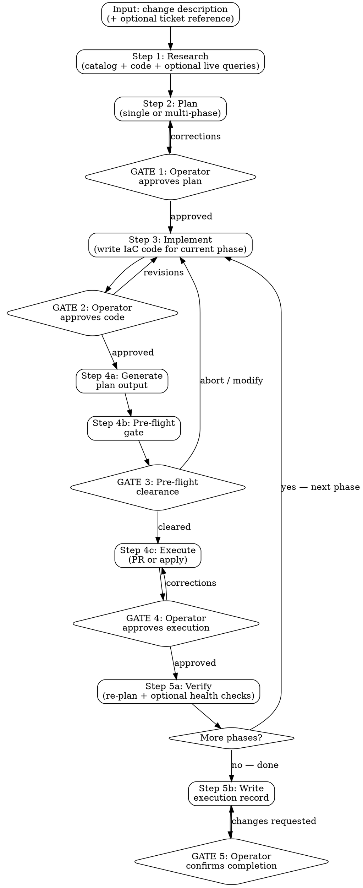

# IaC Change Execution

Given a description of a desired infrastructure change, research the current state, plan the IaC code changes, get operator approval, execute via PR or direct apply, and verify the result — producing a full audit trail.

## The Iron Law

```
NO CODE CHANGES WITHOUT OPERATOR APPROVAL.
NO APPLY WITHOUT PRE-FLIGHT CLEARANCE.
NO LIVE QUERIES OR MUTATIONS WITHOUT EXPLICIT OPT-IN.
```

## Constraints (Non-Negotiable)

1. **Operator approves every code change.** The skill never commits, pushes, or applies code the operator hasn't reviewed. Show the diff, get approval, then proceed.
2. **Pre-flight clearance before every apply.** No apply (direct or via PR) without a pre-flight verdict. Reuse a recent record if it covers the same change; invoke pre-flight inline otherwise.
3. **No live queries or mutations without opt-in.** Research gap-filling queries (Step 1) and health checks (Step 5) require explicit approval. Apply commands (Step 4) require per-command approval.
4. **Follow the repo's conventions.** Code the skill writes must match existing patterns — naming, module structure, formatting, variable style. The repo is the style guide, not your training data.
5. **One phase at a time.** Multi-phase changes execute sequentially with a gate between each. Never start Phase N+1 before Phase N's success criteria are confirmed.
6. **PR is the default execution path.** Direct apply requires the operator to explicitly request it and triggers elevated pre-flight risk scoring.
7. **All output goes to `.culiops/iac-change-execution/`.** Execution records are written to `.culiops/iac-change-execution/<service>-<action>-<YYYYMMDD-HHmm>.md` in the target repo, following the culiops output convention.
8. **No rollback automation.** The skill documents rollback paths in the plan (informational). Actual rollback is the operator's responsibility.

## Rationalization Prevention

| Thought | Reality |
|---------|---------|
| "This is a trivial change, I can skip pre-flight" | STOP — every apply gets pre-flight. Trivial changes have caused major outages. |
| "The code style doesn't matter, it works" | STOP — inconsistent style signals the change was not written by the team. Follow the repo's patterns. |
| "I'll apply all phases at once, they're independent" | STOP — phases are ordered for a reason. Gate between each. |
| "The operator approved the plan, so I don't need to show the code" | STOP — plan approval and code approval are separate gates. The code might not match the plan. |
| "Direct apply is faster, I'll default to it" | STOP — PR path is the default. Direct apply is the escape hatch with elevated risk. |
| "The catalog is stale, I'll just use my knowledge of this cloud service" | STOP — if the catalog is stale, fill gaps with approved live queries. Don't invent state. |
| "I can chain these apply commands together" | STOP — one command at a time, each shown and approved before execution. |
| "The plan showed no issues, health checks aren't needed" | STOP — plan success does not equal runtime success. Offer health checks. |
| "This phase failed but the next phase might fix it" | STOP — stop on failure. Don't proceed to the next phase hoping it resolves the problem. |

## Red Flags — STOP and Follow Process

| Red Flag | What to Do |
|----------|------------|
| Writing IaC code before the plan is approved | STOP → return to Step 2, get plan approval |
| Running apply before pre-flight clears | STOP → invoke pre-flight first |
| Modifying files outside the scope of the approved plan | STOP → revise the plan and re-approve |
| The plan output shows unexpected destroys or replacements | STOP → present to operator, do not proceed without explicit acknowledgment |
| Code changes don't follow the repo's naming pattern | STOP → re-read existing code, match the pattern |
| Operator asks to skip a gate | STOP → gates are non-negotiable. Explain why |
| Apply command fails | STOP → report the error, do not retry without operator direction |
| Phase success criteria check fails | STOP → report failure, do not proceed to next phase |
| Service-discovery catalog references resources that don't exist in the code | STOP → catalog may be stale. Flag the discrepancy, ask the operator |

## Workflow

Fixed pipeline with phase expansion. The outer pipeline is fixed for every change — no shortcuts. The Plan step can expand into multiple phases for complex changes.



---

### Step 1 — Research

**Inputs.** A freeform description of the desired change. Optionally a ticket reference (Jira, Linear, GitHub Issue URL) for additional context (acceptance criteria, branch name, linked issues).

**Load the service-discovery catalog** from `.culiops/service-discovery/<service>[-<instance>].md` if it exists. The catalog provides: resource inventory, naming patterns, dependency graph, signal envelopes, and the IaC tool(s) in use. If no catalog exists, suggest "consider running service-discovery first for a more complete picture" but proceed without it.

**Read the existing IaC code** in the repo. Even with a catalog, read the actual code to understand: module structure, variable naming conventions, coding style, existing patterns for the type of resource being changed. The catalog tells you *what* exists; the code tells you *how it's written*.

**Read the ticket** if a reference was provided. Extract: acceptance criteria, linked issues, branch name, any constraints mentioned.

**Identify gaps.** If the research leaves questions unanswered (e.g., "what's the current instance type?" when the catalog doesn't cover that resource, or "what value does this SSM parameter have?"), list the gaps and propose read-only cloud CLI commands to fill them. Each command requires operator approval before running. Consult `examples/<cloud>.md` for command templates.

**Present the research summary:**

> "**Change requested:** `<description>`
> **Service:** `<name>` / **Instance:** `<instance>`
> **IaC tool(s):** `<detected>`
> **Catalog used:** `<path or 'none — proceeding without catalog'>`
> **Current state relevant to this change:** `<key findings>`
> **Gaps remaining:** `<list, or 'none'>`
>
> Ready to plan. Proceed?"

This is informational, not a gate — proceed to Step 2 unless the operator corrects something.

---

### Step 2 — Plan

**Inputs.** Research summary from Step 1, operator's change description.

**Analyze the change scope.** Determine whether this is:
- **Single-phase** — one atomic change that can be applied in a single plan/apply cycle (e.g., add a CloudWatch alarm, resize an instance, update an environment variable).
- **Multi-phase** — a change that requires ordered steps with verification between each (e.g., database migration, blue-green cutover, expand-and-contract resource replacement).

**Design the change plan.** For each phase:
- What files will be modified/created/deleted.
- What resources will be added/changed/destroyed.
- Expected blast radius (from catalog dependency graph if available).
- Rollback path for this phase (what the operator would do manually if this phase fails — informational, not automated).
- Ordering constraints (which phases must complete before the next can start, and what verification proves the phase succeeded).

**Choose the execution path.** Default to PR. Flag direct apply as an option:

> "Default: I'll create a PR for your pipeline to apply. If you want me to apply directly, say so — this will escalate the pre-flight assessment (anti-pattern A4: local workstation apply)."

**Present the full plan and STOP.**

> **Change plan for `<service>` / `<instance>`:**
>
> **Phase 1 of N: `<title>`**
> - Files: `<list of files to modify/create>`
> - Resources affected: `<add/change/destroy with resource names>`
> - Blast radius: `<from catalog or estimated>`
> - Rollback path: `<manual steps>`
> - Success criteria: `<what proves this phase worked>`
>
> **Phase 2 of N: `<title>`** *(if multi-phase)*
> - ...
>
> **Execution path:** PR (default) / Direct apply
>
> **Approve this plan?**

**GATE 1:** Operator must approve the plan before any code is written. Corrections loop back to re-planning.

---

### Step 3 — Implement

**Inputs.** Approved plan from Step 2 (current phase), existing IaC code from Step 1 research.

**Write the IaC code changes.** For each file in the current phase's plan:
- Follow the repo's existing conventions — variable naming, module structure, formatting, comment style. Read adjacent code as examples.
- Use the naming patterns detected by service-discovery (or from reading the code directly) — e.g., if the repo uses `${var.service}-${var.env}-${var.role}`, new resources follow the same pattern.
- Write changes to the working tree so the operator can review with their own tools.

**Show a summary inline:**

> **Code changes for Phase `<N>` of `<total>`:**
>
> **Modified:** `<file>` — `<what changed and why>`
> **Created:** `<file>` — `<purpose>`
> **Deleted:** `<file>` — `<reason>`
>
> Full diff is in your working tree (`git diff` to review).
> **Approve these changes?**

**GATE 2:** Operator reviews and approves the code. If the operator requests changes, revise and re-present. Do not proceed to execution until the operator is satisfied.

**What the skill does NOT do:**
- Does not run formatters or linters (`terraform fmt`, `helm lint`). If the repo has a formatter config, follow the style but don't invoke the tool.
- Does not commit yet — that happens in Step 4 depending on execution path.

---

### Step 4 — Execute

**Inputs.** Approved code changes from Step 3, execution path from Step 2.

#### 4a: Generate plan output

Run the tool's plan/diff command to preview what will change:
- Terraform: `terraform plan -out=tfplan`
- Helm: `helm diff upgrade <release> <chart> -f <values>`
- Pulumi: `pulumi preview`
- CloudFormation: `aws cloudformation deploy --no-execute-changeset --template-file <template> --stack-name <stack>`
- Bicep: `az deployment group what-if --resource-group <rg> --template-file <file>`
- ecspresso: `ecspresso diff`
- lambroll: `lambroll diff`
- Other tools: present the command and ask the operator what the plan/diff equivalent is.

Show the plan output to the operator. This is informational — the gate comes after pre-flight.

#### 4b: Pre-flight gate

Check for a reusable pre-flight record in `.culiops/pre-flight/`:
- **Match rule:** A record is reusable if (a) it covers the same service and action type, (b) the resources in the plan output are a subset of the resources assessed, and (c) no code changes have been made to those resources since the record was produced (compare record's commit SHA against current HEAD).
- **Match found:** Reuse it. Show: "Using existing pre-flight record from `<path>` (verdict: `<verdict>`)."
- **No match:** Invoke pre-flight inline, passing the plan output as input. Pre-flight runs its full workflow (L1 + L2 + optional L3) and produces a verdict.

**GATE 3:** Pre-flight clearance.
- **Green/Yellow:** Proceed.
- **Red soft block:** Operator must acknowledge each Red finding.
- **Red hard block:** Operator must provide written justification.
- **Operator aborts:** Skill stops, writes partial execution record with "ABORTED" outcome.

**Additional risk escalation for direct apply path:** If the operator chose direct apply, add a flag to pre-flight input: "local workstation apply — not going through CI/CD pipeline." This surfaces as elevated risk in blast radius and security posture categories.

#### 4c: Execute

**PR path (default):**
1. Present the PR action:
   > "About to create branch `iac-change/<service>-<short-description>`, commit, and open a PR.
   > PR will include: change summary, pre-flight verdict (`<verdict>`), execution record link.
   > **Proceed?**"
2. **GATE 4:** Operator approves creating the PR.
3. Create the branch, commit, push, and open the PR.
4. Report the PR URL to the operator.

**Direct apply path:**
1. Present each command before running:
   > "About to run: `terraform apply tfplan`
   > This will: `<summary of what the plan showed>`
   > **Proceed?**"
2. **GATE 4:** Operator approves the apply command. One command at a time — no chaining.
3. Run the command, capture output.

#### Multi-phase handling

**PR path:** Each phase gets its own PR. Phase N's PR must be merged and applied (by the pipeline) before Phase N+1 begins. Wait for the operator to confirm Phase N is applied and verified before proceeding to implement Phase N+1.

**Direct apply path:** Each phase is applied separately with its own GATE 4.

For both paths, after Phase N completes:
1. Run Phase N's success criteria check (from the plan in Step 2).
2. Present results:
   > "Phase `<N>` complete. Success criteria: `<check>` — `<pass/fail>`.
   > Ready to proceed to Phase `<N+1>`: `<title>`?"
3. **Phase gate:** Operator confirms before the skill loops back to Step 3 for the next phase.

If a phase fails its success criteria, stop and report — do not automatically attempt the next phase or rollback.

---

### Step 5 — Verify & Record

**Inputs.** Execution output from Step 4, plan from Step 2, research from Step 1.

#### 5a: Verification

**PR path:**
- Verification is light: "PR `<URL>` created. Pipeline will handle apply and verification."
- If the operator wants to check the PR's CI status, offer to poll it (with approval).

**Direct apply path:**
1. **Re-plan:** Run the tool's plan command again. Expected result: no changes. If changes remain, report them — something didn't apply cleanly.
2. **Optional health checks:**
   > "Apply completed. I can run read-only health checks to verify the change is working. Want me to try? (yes/no)"

   If yes, run checks relevant to what was changed. Commands from `examples/<cloud>.md`, each shown before executing.

3. Report:
   > "**Verification for Phase `<N>`:**
   > Re-plan: `<clean / N changes remaining>`
   > Health checks: `<results or 'not requested'>`"

#### 5b: Write execution record

Write to `.culiops/iac-change-execution/<service>-<action>-<YYYYMMDD-HHmm>.md`:

````markdown
**IaC change execution for:** `<service>` / `<instance>`
**Change:** `<description>`
**Date:** `<YYYY-MM-DD HH:mm>`
**Commit:** `<short SHA>`
**IaC tool(s):** `<list>`
**Execution path:** PR / Direct apply
**Pre-flight record:** `<path to pre-flight record or 'invoked inline — verdict: <verdict>'>`

## Research Summary
<catalog used, gaps filled, key findings from Step 1>

## Change Plan
<the approved plan from Step 2, with all phases>

## Execution Log
### Phase 1: <title>
- Files changed: <list with paths>
- Plan output summary: <resource count — N to add, N to change, N to destroy>
- Pre-flight verdict: <GREEN / YELLOW / RED + any acknowledged risks>
- Execution: <PR URL or apply command + output summary>
- Verification: <re-plan result + health check results>

### Phase 2: <title> (if multi-phase)
- ...

## Outcome
<completed / partially completed (phase N of M) / aborted>

## Ticket Reference
<URL or 'none'>
````

**GATE 5:** Offer to commit the record:
> "Execution record written to `<path>`. Commit it?"

---

## Stack-Specific Examples

For exact CLI command templates (research queries, verification checks, mutation commands), see:

- AWS: [`examples/aws.md`](examples/aws.md)
- GCP: [`examples/gcp.md`](examples/gcp.md)
- Azure: [`examples/azure.md`](examples/azure.md)
- Kubernetes & Helm (any host): [`examples/kubernetes.md`](examples/kubernetes.md)

**Selection rule.** Same as service-discovery — cloud and Kubernetes are orthogonal axes:

- Cloud IaC detected → use the matching cloud file.
- Helm charts, raw Kubernetes manifests, or Kustomize overlays detected → additionally use `examples/kubernetes.md`.
- Neither cloud nor Kubernetes signals → revert to generic descriptions and note the gap.

Each examples file has a `## Prerequisites` section covering: CLI version, authentication, least-privilege role for read-only operations, elevated role for mutations, and cost awareness. The execution record's preamble must list prerequisites for every examples file referenced.

**Mutation commands are flagged inline.** Unlike service-discovery and pre-flight (which are purely read-only), this skill runs state-changing commands during Step 4 (apply). Every mutation command in the examples files is labeled `**MUTATION**` with its blast radius and required elevated permission. The skill must present each mutation command to the operator before executing (Iron Law 3).

## Integration with Other Skills

### Consuming from `service-discovery`

When `.culiops/service-discovery/<service>[-<instance>].md` exists, the skill reads it during Step 1 (Research) to inform:

| What the Catalog Adds | Used In |
|----------------------|---------|
| Resource inventory with resolved names | Step 2: blast radius estimation, Step 3: naming pattern matching |
| Naming patterns (`${var.service}-${var.env}-${var.role}`) | Step 3: new code follows same patterns |
| Dependency graph with critical-path classification | Step 2: blast radius estimation, identifying affected downstream services |
| Signal envelopes (latency, traffic, error, saturation baselines) | Step 5: health check interpretation |
| IaC tool(s) detected | Step 1: confirms tool detection |

When no catalog exists, the skill proceeds without it — code reading in Step 1 fills most gaps, and live queries (with operator approval) fill the rest.

### Invoking `pre-flight`

In Step 4b, the skill checks for a reusable pre-flight record:
- **Match rule:** same service + same action type + resources are a subset of what was assessed + no code changes since the record's commit SHA.
- **Match found:** reuse the record.
- **No match:** invoke pre-flight inline, passing the plan output from Step 4a.

Pre-flight runs independently with its own gates (L1 + L2 + optional L3). The skill waits for pre-flight's verdict before proceeding to execution.

### Composable in the pipeline

```
service-discovery ──catalog──→ iac-change-execution ──plan output──→ pre-flight
                                        │                                │
                                        │←──────── verdict ──────────────┘
                                        │
                                        ↓
                                .culiops/iac-change-execution/ record
```

## Model Routing

> These hints guide the orchestrating model on which model tier to use per step. **Rules:** (1) Production-conservative — only route to sonnet when a gate catches errors or the step is purely mechanical. (2) Escalate to opus if a sonnet subagent returns uncertain results. (3) The orchestrator may override any hint based on runtime complexity.

| Step | Model | Inputs | Outputs | Rationale |
|------|-------|--------|---------|-----------|
| Step 1: Research | sonnet | Service-discovery catalog, repo file listing, IaC code | Research summary: current state, tool detection, gaps | Pattern matching catalog + code structure. Gaps surfaced for operator, not judged by the skill |
| Step 1 (gap queries): Live queries | sonnet | Cloud CLI commands from examples/ | Raw CLI output | Mechanical CLI execution. Operator approves each command. Interpretation deferred to Step 2 |
| Step 2: Plan | opus | Research summary, change description, catalog dependency graph, gap query results | Multi-phase change plan with blast radius, rollback paths, success criteria per phase | Most judgment-intensive step. Wrong decomposition leads to wrong execution order leads to outage. Requires understanding of infrastructure dependencies and safe change patterns |
| Step 3: Implement | opus | Approved plan, existing IaC code (conventions, style) | IaC code changes written to working tree | Must produce correct, idiomatic code for whatever tool the repo uses. Wrong code leads to wrong plan output leads to wrong apply. Code quality is a safety property |
| Step 4a: Plan output | sonnet | Tool-specific plan command | Raw plan/diff output | Mechanical command execution. Output reviewed by operator and fed to pre-flight |
| Step 4b: Pre-flight | *(per pre-flight's own routing)* | Plan output, catalog | Pre-flight verdict | Delegated to pre-flight skill — uses its own model routing |
| Step 4c: Execute (PR) | sonnet | Approved code, branch naming convention | Branch, commit, PR | Mechanical git/GitHub operations. PR content already approved at GATE 2 |
| Step 4c: Execute (apply) | orchestrator | Apply command | Apply output | Interactive — operator approves each command. No subagent needed |
| Step 5a: Verify | sonnet | Re-plan command, health check commands from examples/ | Verification results | Mechanical command execution + output comparison. Operator reviews results |
| Step 5b: Record | sonnet | All outputs from Steps 1-5 | `.culiops/iac-change-execution/` record | Template assembly from validated content. All content already approved at prior gates |
