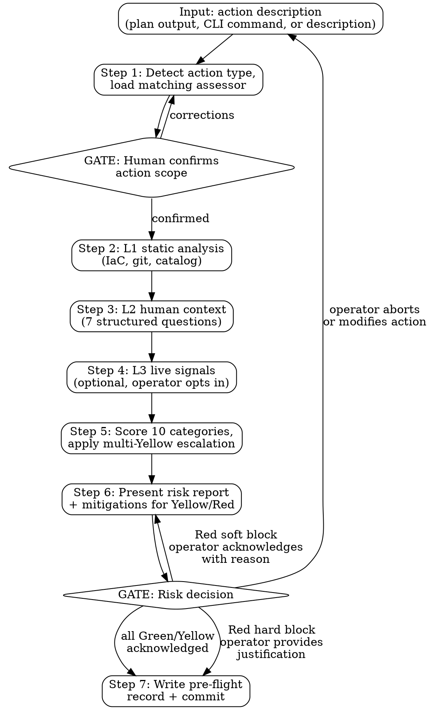

# Pre-Flight

Evaluate the risk of a proposed production action across 10 categories using up to 3 layers of context (static code analysis, human-supplied situational context, optional live signals). Produce a risk report with go/no-go gate, per-category scoring, and actionable mitigations for high-risk findings.

## The Iron Law

```
NO ASSUMPTIONS ABOUT RISK LEVEL. IF UNCLEAR, SCORE CONSERVATIVELY.
NO LIVE QUERIES WITHOUT OPERATOR OPT-IN.
NEVER DOWNGRADE A HARD BLOCK WITHOUT WRITTEN JUSTIFICATION.
```

## Constraints (Non-Negotiable)

1. **Score from evidence, not intuition.** Every risk score must trace to a specific signal: a line in the plan output, a git log entry, an operator's answer, or a live query result. If no signal exists for a category, score it as ⚪ unknown — never silently assume Green.
2. **No live queries without opt-in.** Layer 3 signals require explicit operator consent. All L3 queries are read-only. The skill must present each L3 command before executing it and confirm the operator agrees.
3. **Hard blocks require written justification.** Categories 2 (reversibility), 5 (timing context), 9 (security posture), and 10 (resource health) can produce hard blocks for specific conditions. The operator must provide a written reason to proceed past a hard block, which is recorded in the pre-flight report.
4. **No modifications to infrastructure.** The skill reads plan outputs, IaC code, git history, and (with opt-in) live system signals. It never runs `apply`, `deploy`, `create`, `update`, `delete`, or any state-changing command.
5. **Plan output is the primary input.** Ask the operator to provide a plan/diff output before starting. If they cannot, the skill still works using IaC code and git history alone but flags "no plan output reviewed — L1 analysis is partial" in the report.
6. **Gate decisions belong to the human.** The skill produces a risk report with a recommendation. The operator decides whether to proceed. The skill records the decision, not enforces it.
7. **All output goes to `.culiops/pre-flight/`.** Pre-flight records are written to `.culiops/pre-flight/<service>-<action>-<YYYYMMDD-HHmm>.md` in the target repo, following the culiops output convention.

## Risk Categories

| # | Category | Green | Yellow | Red | Hard Block? |
|---|----------|-------|--------|-----|-------------|
| 1 | **Blast radius** | Single resource, single region | Multiple resources or shared component | Multi-region, multi-service, or user-facing data path | No |
| 2 | **Reversibility** | Known rollback path, automated | Manual rollback possible but untested | Irreversible (data migration, schema drop, encryption key rotation) | Yes — irreversible data changes |
| 3 | **Change velocity** | First change to this area in 7+ days | 2–3 changes in last 7 days | 4+ changes in last 7 days, or stacking on uncommitted prior change | No |
| 4 | **Dependency impact** | No critical-path dependencies touched | Touches resource with downstream dependents | Touches shared infrastructure (DB, message bus, auth) used by multiple services | No |
| 5 | **Timing context** | Normal hours, no freeze, no incidents | Outside business hours or reduced staffing | Active incident, deploy freeze, peak traffic event, or holiday | Yes — active incident + deploy freeze |
| 6 | **Operator familiarity** | Changed this service/tool many times | First time with this specific service | First time with both service and tool | No |
| 7 | **Observability readiness** | SLOs declared, alarms in place, dashboards exist | Partial — some signals missing | No alarms, no SLOs, no way to detect if this breaks something | No |
| 8 | **Cost impact** | No new resources, no size changes | New resources or size increase with predictable cost | GPU/high-memory instances, cross-region replication, usage-based services with unpredictable scale | No |
| 9 | **Security posture** | No security-relevant changes | Permission scope change, network rule modification within VPC | Opens public access, widens IAM to `*`, removes encryption, disables audit logging, exposes secrets | Yes — public exposure, encryption removal, secrets |
| 10 | **Resource health** | All signals nominal, error budget healthy | Elevated error rate or saturation above 70% | Error budget exhausted, active alerts firing, saturation critical | Yes — error budget exhausted |

### Scoring Rules

- **Traffic light:** Red / Yellow / Green per category. Unknown (⚪) when data is unavailable.
- **Hard blocks:** Categories 2, 5, 9, 10 can produce hard blocks for specific conditions listed above. Hard block = operator must provide written justification to proceed, not just acknowledge.
- **Soft blocks:** All other Red scores. Operator must acknowledge and can proceed.
- **Multi-Yellow escalation:** 3+ Yellow categories → overall assessment escalates to Red (soft block). Compound risk — individually manageable, collectively dangerous.
- **Unknown handling:** ⚪ counts toward Yellow for multi-Yellow escalation. 3+ unknowns → suggest the operator gather more information before proceeding.

## Context Layers

### Layer 1 — Static Analysis (always runs)

**Sources:** IaC code, plan/diff output, git history, service-discovery catalog (if exists).

| Category | L1 Analysis |
|----------|-------------|
| Blast radius | Count resources in plan, check if multi-region, check if touches load balancer / DNS / IAM (shared resources) |
| Reversibility | Detect destructive actions: `destroy`, `replace`, `force_new`, schema migrations. Check if rollback mechanism exists (previous code in git, Helm revision history, ecspresso rollback) |
| Change velocity | `git log --since=7.days` on files touched by this change. Count recent commits to same paths |
| Dependency impact | If catalog exists: check if changed resources are marked critical-path or have downstream dependents. If no catalog: score as ⚪ unknown |
| Observability readiness | Scan IaC for alarm/alert/SLO definitions related to changed resources. Flag resources with no declared monitoring |
| Cost impact | Detect new resources, instance type changes, replica count changes. Flag known expensive types (GPU, NAT Gateway, cross-region replication) |
| Security posture | Detect ingress rule changes, IAM policy modifications, encryption settings, public access flags, audit logging changes, secret reference changes |

### Layer 2 — Human Context (always asks)

Seven structured questions, asked once before scoring:

> **Pre-flight context check:**
> 1. Is there an active incident affecting this service or its dependencies? (yes/no)
> 2. Is there a deploy freeze or change window restriction? (yes/no)
> 3. Is this during peak traffic hours for this service? (yes/no/unsure)
> 4. Have you changed this service before? (many times / a few times / first time)
> 5. Have you used this IaC tool before? (experienced / some experience / first time)
> 6. What's the expected cost impact? (negligible / moderate / significant / unknown)
> 7. Any other context I should know? (free text, optional)

The skill does NOT ask questions it can already answer from L1. If L1 determined the git history shows this operator has committed to this repo 50 times, skip question 4.

The matched assessor (from `assessors/*.md`) may add assessor-specific questions. Those are asked after the standard 7.

### Layer 3 — Live Signals (optional, operator opts in)

Before attempting L3, the skill asks:

> "I can check live system health if you have CLI access. This runs read-only queries only. Want me to try? (yes/no)"

If yes, consult `examples/<cloud>.md` for:

| Category | L3 Query |
|----------|----------|
| Resource health | Current error rate, CPU/memory saturation, recent alarms firing |
| Observability readiness | Verify dashboards/alarms actually exist in the live system (not just in IaC) |
| Timing context | Current request rate vs. baseline (is this peak?) |
| Cost impact | Current spend rate on resources being changed |

If any query fails (no credentials, permission denied, timeout), the skill records "L3 unavailable for [category] — scoring based on L1+L2 only" and proceeds. No hard failure.

## Rationalization Prevention

| Thought | Reality |
|---------|---------|
| "This plan only adds resources, so it's safe" | STOP — additions can break existing resources via dependency changes, exhaust quotas, or introduce cost surprises. Score blast radius and dependency impact from the plan. |
| "It's just a config change, not infrastructure" | STOP — config changes cause more outages than infra changes. Evaluate the same 10 categories. |
| "The operator said there's no incident, so timing is Green" | STOP — also check deploy freeze and peak hours. One Green answer doesn't clear the category. |
| "There's no service-discovery catalog, so I can't assess dependencies" | STOP — score dependency impact as ⚪ unknown and surface it. Don't skip the category. |
| "This is a rollback, so it's inherently safe" | STOP — rollbacks can fail, can roll back to a broken state, or can conflict with data migrations that happened after the original deploy. Assess normally. |
| "The operator is experienced, so I can relax the scoring" | STOP — operator familiarity is one category out of 10. It doesn't lower blast radius or fix missing observability. |
| "L3 queries failed, so I'll assume the system is healthy" | STOP — absence of data is not evidence of health. Score as ⚪ unknown. |
| "This change passed CI, so it's safe for production" | STOP — CI validates code correctness, not production risk. Timing, blast radius, and resource health are invisible to CI. |
| "The same change worked fine in staging" | STOP — staging doesn't have production traffic, production data, or production dependencies. Score production risk independently. |
| "Multiple Yellows are fine because none is Red" | STOP — check multi-Yellow escalation rule. 3+ Yellows escalate to Red. Compound risk is real. |

## Red Flags — STOP and Follow Process

| Red Flag | What to Do |
|----------|------------|
| Scoring a category without data from any layer | STOP → score as ⚪ unknown, surface in report |
| Skipping L2 questions because "the operator seems busy" | STOP → L2 is mandatory. 7 quick questions. |
| Downgrading a Red to Yellow without operator justification | STOP → hard blocks require written justification recorded in the report |
| Presenting mitigations without checking if operator commits to them | STOP → record committed vs. declined mitigations |
| Running L3 queries that modify state | STOP → L3 is read-only. Check the command against `examples/` before executing |
| Proceeding after operator aborts | STOP → write the record as "aborted" with reason, don't discard the assessment |
| Producing a risk report without checking all 10 categories | STOP → every category must have a score (Green/Yellow/Red/⚪), even if most are Green |
| Assuming a service is healthy because no one mentioned problems | STOP → resource health is an L3 signal. Without L3, score as ⚪ unknown |

## Workflow



---

### Step 1 — Detect action type & load assessor

The operator provides either:
- A plan/diff output (`terraform plan`, `helm diff`, `pulumi preview`, `ecspresso diff`, etc.)
- A CLI command they're about to run
- A description of the action they're about to take

Load every `assessors/*.md` file and match against the input:
1. Check each assessor's `triggers` frontmatter and `## Input Recognition` section
2. Select the matching assessor
3. If no assessor matches, use a generic checklist (all 10 categories, but without tool-specific analysis)
4. If multiple assessors match (unlikely), ask the operator which applies

Present the detected action type, scope, and matched assessor to the operator.

**GATE 1:** Human confirms action scope. "I detected this as a [action type] change affecting [resources]. Is this correct?"

### Step 2 — L1 static analysis

Using the matched assessor's `## L1 — Static Risk Signals` section, analyze:
- The plan/diff output (primary source)
- The IaC code in the repo (for context the plan doesn't show — module structure, variable definitions)
- Git history (`git log --since=7.days` on changed files)
- Service-discovery catalog if it exists (`.culiops/service-discovery/<service>.md`)

Produce preliminary scores for categories: 1 (blast radius), 2 (reversibility), 3 (change velocity), 4 (dependency impact), 7 (observability readiness), 8 (cost impact), 9 (security posture).

Categories 5 (timing), 6 (familiarity), and 10 (resource health) require L2 or L3 — leave them as pending.

### Step 3 — L2 human context

Ask the 7 structured questions from the Context Layers section above. Skip questions where L1 already has a confident answer.

Then ask any assessor-specific questions from `## L2 — Context Questions`.

Fill in categories 5 (timing context) and 6 (operator familiarity). Refine category 8 (cost impact) if the operator provides cost context.

### Step 4 — L3 live signals (optional)

Ask: "I can check live system health if you have CLI access. This runs read-only queries only. Want me to try? (yes/no)"

If yes:
1. Determine which cloud/platform applies (from L1 detection or ask)
2. Load `examples/<cloud>.md` for the relevant platform
3. Run read-only queries from the assessor's `## L3 — Live Query Hooks` section
4. Present each command before executing and confirm with the operator
5. Record results and use them to fill in category 10 (resource health) and refine categories 7 (observability) and 5 (timing)

If no, or if queries fail:
- Score category 10 as ⚪ unknown
- Note "L3 not requested" or "L3 unavailable for [category]" in the report
- Proceed with L1+L2 scores only

### Step 5 — Score

Apply the traffic-light scoring from the Risk Categories table:
1. Score each of the 10 categories as Green / Yellow / Red / ⚪ based on the strongest signal from L1+L2+L3
2. For each Yellow or Red score, record the specific signal that drove the score
3. Check hard-block conditions on categories 2, 5, 9, 10
4. Apply multi-Yellow escalation: count Yellow + ⚪ categories. If 3+ → overall verdict escalates to Red (soft block)
5. Determine overall verdict:
   - All Green → **GREEN — proceed**
   - Any Yellow but < 3 → **YELLOW — proceed with caution**
   - 3+ Yellow (escalation) → **RED — soft block**
   - Any Red (no hard block) → **RED — soft block**
   - Any hard block triggered → **RED — hard block**

### Step 6 — Present risk report

Display the scorecard, overall verdict, and for each Yellow/Red/⚪ finding:
1. **What was found** — the specific signal (e.g., "Plan destroys `database.main` — stateful resource deletion")
2. **Why it matters** — the risk in concrete terms (e.g., "Database data will be permanently lost; downstream services will lose their data store")
3. **Mitigation** — a concrete action to reduce risk (e.g., "Snapshot the database before applying. Verify all downstream services have been migrated to the new database.")

For Green categories, show the category name and "Green" — no detail needed.

**GATE 2:** Risk decision. The operator must:
- **Green/Yellow:** Acknowledge and proceed, or abort
- **Red (soft block):** Acknowledge each Red finding with a stated reason, or abort
- **Red (hard block):** Provide written justification for each hard block, or abort

### Step 7 — Record

Write the pre-flight record to `.culiops/pre-flight/<service>-<action>-<YYYYMMDD-HHmm>.md`.

The record preserves the audit trail: what was assessed, what the scores were, what the operator acknowledged, and what mitigations were committed to. See Output Format below.

If the operator aborted, still write the record with verdict "ABORTED" and the reason.

Offer to commit: `git add .culiops/pre-flight/<filename> && git commit -m "pre-flight: <service> <action> — <verdict>"`

## Output Format

The pre-flight record written to `.culiops/pre-flight/<service>-<action>-<YYYYMMDD-HHmm>.md`:

````markdown
**Pre-flight assessment for:** `<service>` / `<instance>`
**Action:** `<brief description>`
**Date:** `<YYYY-MM-DD HH:mm>`
**Commit:** `<short SHA of current state>`
**Assessor used:** `<iac-change | cli-command | generic>`
**Layers evaluated:** `L1 (static) + L2 (human) [+ L3 (live)]`

## Verdict: <GREEN / YELLOW — PROCEED WITH CAUTION / RED — SOFT BLOCK / RED — HARD BLOCK / ABORTED>

## Risk Scorecard

| # | Category | Score | Finding | Mitigation |
|---|----------|-------|---------|------------|
| 1 | Blast radius | 🟢 | ... | — |
| 2 | Reversibility | 🟡 | ... | ... |
| ... | ... | ... | ... | ... |

## Hard Blocks
<none, or list with required justification provided by operator>

## Acknowledged Risks
<list of Yellow/Red items operator acknowledged, with their stated reason>

## Mitigations Committed
<list of mitigations the operator agreed to perform>

## Context Provided (L2)
<summary of operator's answers to the 7 questions>

## L1 Analysis Detail
<what was scanned, what catalog was used, git history summary>

## L3 Queries Run
<list of commands run and results, or "L3 not requested">
````

## Integration with Other Skills

### Consuming from `service-discovery`

When `.culiops/service-discovery/<service>[-<instance>].md` exists, pre-flight reads it to enrich:

| Category | What the Catalog Adds |
|----------|----------------------|
| Blast radius | Resource count, whether resource is on user-facing data path |
| Dependency impact | Critical-path dependencies, downstream services, shared infrastructure |
| Observability readiness | Declared signal envelopes, known alarm gaps |
| Security posture | Secret references, IAM roles already in use |

When no catalog exists, pre-flight still works — it scores dependency impact and observability as ⚪ unknown and suggests "consider running service-discovery first for a more complete assessment."

### Composable Gate for Future Skills

Pre-flight is designed to be called by other skills as a risk gate:

```
service-discovery → (catalog) → pre-flight ← iac-change-execution (future)
                                           ← incident-investigation (future)
```

Pre-flight takes the same input, produces the same report, and enforces the same gates regardless of whether it's invoked directly or by another skill. The calling skill checks the verdict before proceeding.

### Incident Context

During incident investigation, if the operator considers a mitigation action (rollback, drain, failover), pre-flight can assess it. When the operator answers "yes" to the active-incident question (L2 Q1), the skill asks a follow-up:

> "Is this change a mitigation for the active incident? (yes/no)"

If yes, the timing category scores as **Yellow** (caution, not block) instead of Red, and the report records "mitigation during active incident — elevated risk accepted."

If no, the hard block stands.
