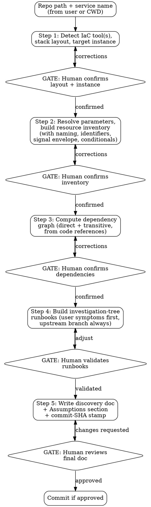

# Service Discovery

Scan a service's infrastructure-as-code repo and produce a troubleshooting-oriented inventory: a resource catalog, naming/tagging patterns, a dependency map, and per-symptom investigation runbooks. The output must be accurate enough that an on-caller who has never seen the service can use it to diagnose a live incident.

## The Iron Law

```
NO ASSUMPTIONS. IF UNCLEAR, ASK THE HUMAN.
NO OUT-OF-SCOPE ACTIONS WITHOUT HUMAN APPROVAL.
ONLY READ INFRASTRUCTURE-AS-CODE AND DOCUMENTATION FILES. NEVER READ SECRETS.
```

## Constraints (Non-Negotiable)

1. **The IaC code is the source of truth.** Every claim in the catalog must trace back to a specific file and line in the repo. Do not invent resources, dependencies, or thresholds from outside knowledge of "what services usually look like." If the code does not say it, the catalog does not say it.
2. **No assumptions.** If anything is unclear during discovery — a resource's purpose, a naming token, a dependency, an unresolved parameter, whether a conditional resource is enabled in the target instance — STOP and ask the human. An incomplete catalog with explicit questions is better than a complete catalog with wrong claims.
3. **Stop at the stack boundary.** A "stack" is the deploy unit (Terraform root module, CloudFormation stack, Pulumi project, Helm release, Bicep deployment). Read everything inside the in-scope stack(s); do NOT follow references into other stacks. Cross-stack references get recorded as *dependencies*, not chased.
4. **Strict scope.** Anything outside the named repo paths — running cloud CLIs, modifying infrastructure, reading other repos, calling external APIs — requires explicit human approval before you do it.
5. **No secrets, ever.** Do not read files that are likely to contain secrets (anything matching common patterns: `*.enc.*`, `*.secret.*`, `secrets/`, `.env*`, `*.pem`, `*.key`, `id_rsa*`, files inside `vault/`, files referenced by tools like SOPS / sealed-secrets / Doppler / 1Password CLI). When the IaC declares a secret reference (e.g., `aws_secretsmanager_secret_version`, `data.vault_generic_secret`, `azurerm_key_vault_secret`), record the *reference*, not any value.
6. **Resolve to a single, named instance.** A repo is a template; the catalog is about a specific instance (one environment, one region, one tenant — whatever the smallest deploy-target unit is in this repo). Confirm with the human which instance is being cataloged before scanning.
7. **User confirmation at every gate.** Five workflow gates exist. None are optional.

## Rationalization Prevention

| Thought | Reality |
|---------|---------|
| "This resource is probably X" | STOP — read the code or ask. |
| "The naming pattern is obviously…" | STOP — verify from the code; report what the code actually says. |
| "I'll resolve `${var.x}` to its default value" | STOP — defaults can be overridden per instance. Resolve from the actual instance's parameter source, or ask. |
| "I'll just follow this module reference into the other stack" | STOP — other stacks are out of scope. Record the cross-stack reference as a dependency and stop. |
| "This `.env` file might tell me which region this deploys to" | STOP — never read files in the secrets-shape. Ask the human for non-secret config. |
| "I can skip the dependency-graph step; nothing depends on this service" | STOP — verify by tracing references in the code; absence of evidence is not evidence of absence. |
| "I'll write the runbook section without confirmation" | STOP — runbooks must be validated against the user's actual investigation patterns. |
| "The four golden signals don't apply to this resource type" | STOP — record the envelope as `n/a` with a reason, don't omit. |

## Red Flags — STOP and Follow Process

| Red Flag | What to do |
|----------|------------|
| Writing the discovery doc before the human confirms inventory and dependencies | STOP → return to the inventory gate (Step 2) and resolve. |
| Skipping the IaC-tool-detection sub-step because "this is obviously Terraform" | STOP → run detection anyway; mixed-tool repos are common. |
| Filling in the dependency section by guessing or by general knowledge of the cloud | STOP → derive from code references only; ask the human for anything inferred. |
| Reading a file outside the named repo paths without approval | STOP → ask the human for permission. |
| Building investigation runbooks before the resource inventory is confirmed | STOP → return to Step 2. |
| A naming-pattern token whose origin you can't point at in the code | STOP → re-trace, or ask the human. |
| Producing a runbook that has no user-visible-symptom anchor | STOP → rewrite to lead with the user-facing symptom. |
| Producing a runbook that has no "is this an upstream dependency?" branch | STOP → add the dependency-first branch. |
| Emitting a final catalog without the "Assumptions and Caveats" section | STOP → add it. The catalog is incomplete without it. |
| Continuing after the human says something is wrong without addressing it | STOP → fix all flagged issues before proceeding. |

## Workflow



---

### Step 1: Detect IaC Tool, Stack Layout, and Target Instance

**Inputs.** A repo path and a service name. If either is missing, ask. Detect a service name from the current working directory if the user said "discover this" without naming one.

**Detect the IaC tool(s) in the repo.** At the start of Step 1, load every file under `tool-detectors/*.md`. Each detector's `## File signatures` section defines what files signal that tool. Match the repo's files against every loaded detector. Record every tool that matches — a repo can use more than one. The currently-shipped detectors are listed in [`tool-detectors/README.md`](tool-detectors/README.md).

For each matched detector, the rest of Step 1 (stack boundary detection) and Steps 2–3 (parameter resolution, resource extraction, dependency derivation) consult the corresponding sections of that detector file (`## Stack boundary`, `## Parameter sources`, `## Resource extraction`, `## Typical cross-stack dependencies`). If a detector omits a section, that dimension is unknown for the matched tool — surface the gap and ask the human.

**Detect unclassified deploy artifacts.** After running the detector pass, scan the repo for files matching deploy-shape patterns (`*.yml`, `*.yaml`, `*.toml`, `*.json`) that were NOT attributed to any loaded detector. **Apply the secrets-exclusion rule first (Constraint 5) — exclude any file whose path matches secrets-shaped patterns (`*.enc.*`, `*.secret.*`, `secrets/`, `.env*`, `*.pem`, `*.key`, `id_rsa*`, `vault/`) before evaluating deploy-shape.** A file is "deploy-shaped" if its top level contains keys from this list: `service:`, `services:`, `cluster:`, `function:`, `functions:`, `task_definition:`, `app:`, `apps:`, `deploy:`, `provider:`, `runtime:`, `image:`, OR if any value contains an `arn:`, `gs://`, or `projects/<id>/...` reference.

If any unclassified deploy-shaped files are found, **STOP** and present:

> "I see these files that look like deploy descriptors but I don't recognize the tool: `<list>`. For each, please tell me one of:
> - **`<tool name>`** — if it's a known tool I should have a detector for (I'll flag this as a missing detector to contribute)
> - **`teach me`** — describe the stack boundary, parameter sources, and what cloud resources these files deploy. I'll use this for *this scan only* and recommend you contribute a detector file afterward.
> - **`ignore`** — these are not part of any in-scope stack (I'll record them in Assumptions and Caveats)."

Do not proceed to "Detect the stack layout" until every unclassified file has one of the three answers.

This sub-step exists because the Iron Law ("no assumptions, ask the human") cannot fire on files the skill does not look at. Silently skipping unrecognized deploy descriptors would produce a catalog that omits real deployed resources.

**Detect the stack layout.** A "stack" is the deploy unit:

- Terraform: each directory containing a root module (`provider` block + `terraform { backend ... }` or `terraform { required_providers ... }` at the top, no parent module calling it). Instances of a root module are typically multiplied by per-env `*.tfvars` files (commonly `envs/<env>.tfvars` or `terraform.<env>.tfvars`) passed via `-var-file`, by Terraform workspaces, or by Terragrunt environments.
- CloudFormation/SAM: each `template.yaml` / `template.json` is a stack.
- Pulumi: each `Pulumi.yaml` is a project; each `Pulumi.<stack>.yaml` is one instance of it.
- Bicep: each top-level `*.bicep` file deployed at a defined scope (resource group, subscription, management group, or tenant) is a stack. Instances are multiplied by per-env `*.parameters.<env>.json` (ARM parameter files) or `*.bicepparam` files passed via `az deployment <scope> create -p`.
- Helm: each `Chart.yaml` is a chart; each per-environment `values-<env>.yaml` (or each deployed release) is one instance. The base `values.yaml` is the template's defaults, not an instance.
- Kustomize: each directory containing a `kustomization.yaml` (overlay) is an instance.

List the stacks. Note which produce one instance (one-off) vs. many (parameterized template).

**Identify the target instance.** Ask the human:

> "I see this repo is `<tool(s) detected>` and contains the following stacks: `<list>`. Which specific instance should I catalog? (e.g., name an environment, region, workspace, tenant, or release.)"

Do NOT guess. Multi-instance repos are the norm; the wrong instance produces a wrong catalog.

**Detect the parameter sources for the chosen instance.** Examples by tool:

- Terraform: `*.tfvars` files, `TF_VAR_*` env vars, workspace name, remote backend state.
- CloudFormation: stack `Parameters` block, `--parameter-overrides`, exports from other stacks.
- Pulumi: `Pulumi.<stack>.yaml` config + ESC environments + secrets store.
- Bicep: `*.parameters.<env>.json` (ARM parameter files), `.bicepparam` files, inline `az deployment ... -p key=value` overrides, and Key Vault secret URI references (`@Microsoft.KeyVault(SecretUri=...)`).
- Helm: `values.yaml` + `values-<env>.yaml` + `--set` overrides.
- Kustomize: overlay's patches + ConfigMap/Secret generators.

Record where parameters come from, but do not resolve them yet.

**Present and STOP.**

> "Service: `<name>`
> Repo: `<path>`
> IaC tool(s) detected: `<list>`
> In-scope stack(s): `<list>`
> Target instance: `<the one the user named>`
> Parameter source(s) for this instance: `<list of files/refs>`
> Out-of-scope (cross-stack refs to be recorded as dependencies, not followed): `<list>`
>
> Is this correct?"

Wait for human confirmation. Apply corrections and re-present until confirmed.

---

### Step 2: Resolve Parameters and Build Resource Inventory

**Resolve parameters.** For each parameter the in-scope stack(s) declare, resolve it to the value used by the target instance. Sources of a value (in priority order, generally): explicit override → instance-specific file → environment-specific file → workspace mapping → declared default → registry lookup.

If a parameter cannot be resolved (file not present, registry not reachable, value comes from a runtime-only source like an SSM parameter the human hasn't shared) — DO NOT proceed. List the unresolved parameters and ask the human to provide values or to confirm "skip with placeholder, mark as unresolved in catalog."

**Scan the in-scope stack(s).** Use file types from Step 1's tool detection. Read every IaC file in the stack(s). Read documentation files (`README.md`, `docs/**/*.md`) inside the stack(s) to pick up author-supplied context. Skip secrets-shaped files unconditionally.

**Use detector resource-extraction rules.** For each tool matched in Step 1, consult that tool's `## Resource extraction` section in its detector file. Apply the mappings to convert the tool's config keys into inventory rows. The `Type` field uses both the resolved cloud-resource equivalent (e.g., `aws_ecs_service`) AND the detector-prefixed raw type (e.g., `ecspresso/service`) so operators can see the deploy tool's role.

**Extract per resource:**

| Field | Meaning |
|-------|---------|
| Type | The IaC resource type, normalized to a category: compute / storage / database / network / messaging / identity / observability / edge / serverless / data-pipeline / other. Record both the raw type (e.g., `aws_ecs_service`, `google_cloud_run_service`, `Microsoft.App/containerApps`) and the category. |
| Name (resolved) | The actual resource name after parameter substitution — not the template. |
| Naming-pattern fragment | The template form, e.g., `${service}-${env}-${region}-${role}`. |
| Conditional? | If the resource depends on `count`, `for_each`, `enable`, a feature flag, or a Helm `if` — record the gating condition. |
| Identifying dimensions | What an operator would filter by during an incident: tenant id, shard key, region, AZ, deployment id, version. List the ones present in the resource definition or available via tags. |
| Signal envelope | For each critical-path resource, four lines: latency expectation (per percentile), traffic baseline, error budget / threshold, saturation limit (whichever bind first — CPU, memory, connections, queue depth). If declared in code (alarms, SLO objects, alerting rules) — quote it. If not declared — record `not declared` and surface it in the runbook. |
| Source location | File + line range. |

**Detect the naming pattern.** Look across multiple resources for the recurring template (e.g., `${var.service}-${var.env}-${each.key}`). Convert to placeholder form and present it explicitly. Do not invent placeholders the repo does not actually use. If the pattern is inconsistent across resources — record both forms and flag.

**Detect conditional / optional resources.** For each gated resource, write the gating expression and the resolved boolean for the target instance. A resource gated `enable_redis = true` in the target instance → mark "present"; gated and resolved false → mark "not present in this instance."

**Present and STOP.**

> "Resolved parameters: `<key parameters with their resolved values>`
> Unresolved (needs your input): `<list, or "none">`
>
> **Resource Inventory for `<service>` / `<instance>`:**
>
> | Category | Type | Resolved Name | Naming Fragment | Conditional? | Identifying Dimensions | Signal Envelope | Source |
> | … | … | … | … | … | … | … | … |
>
> **Detected naming pattern(s):** `<list>`
> **Optional resources NOT present in this instance:** `<list>`
>
> **Open questions:**
> - …
>
> Is this correct? Anything missing or wrong?"

Wait for confirmation. Apply corrections and re-present until confirmed.

---

### Step 3: Compute the Dependency Graph

**Direct dependencies** — derive from the code:

- Terraform: `depends_on`, references between resources, `data` lookups across providers, `terraform_remote_state` lookups, module `source` references.
- CloudFormation: `DependsOn`, `Ref`/`Fn::GetAtt` references, cross-stack `Fn::ImportValue` / `Outputs.Export`.
- Pulumi: explicit `dependsOn`, resource references in code, `StackReference`.
- Bicep: `existing` resource declarations (same- or cross-scope, e.g. `scope: resourceGroup(...)` / `scope: subscription()`), `module` imports of other `*.bicep` files, role-assignment `principalId` references, Key Vault secret URI references (`@Microsoft.KeyVault(...)`).
- Helm: `requirements.yaml` / `Chart.yaml` `dependencies`, ConfigMap/Secret refs, ServiceAccount + RBAC bindings.
- Kustomize: bases, `replacements`, `patchesStrategicMerge` targets.
- For tools matched via a detector, also consult the detector's `## Typical cross-stack dependencies` section as a hint for what kinds of upstream references to look for. The actual graph is still derived from references in code — the hints help you avoid missing common patterns.

For each dependency, record: the upstream resource (or stack), the linkage (output name, exported value, registry key), and whether the linkage is hard-coded or parameterized.

**Transitive dependencies** — for each direct upstream that itself is in a different stack, you do NOT chase into that stack (Iron Law: stop at boundaries). But you DO record:

- The upstream stack name (as the human knows it).
- What the in-scope stack consumes from it.
- The expected protocol / interface (HTTP, gRPC, queue, event bus, shared database, shared registry, etc.) inferred from the referenced resource type.
- Anything the human tells you about that stack's reliability characteristics (SLO, blast radius, on-call team).

If the human can't characterize an upstream, mark it "**unknown — investigation entry point**" and surface it in the runbook so on-callers don't dead-end.

**Critical-path classification.** For each direct dependency, ask: does a user request to this service synchronously traverse it? Yes → critical path. No → eventual / async / observability-only.

**Render.** Produce a dependency graph (an indented list is fine if a DOT block isn't needed). Mark critical-path edges. Mark cross-stack dependencies. Mark cross-cloud / cross-region / cross-account dependencies (these are blast-radius signals).

**Present and STOP.**

> "**Dependencies for `<service>` / `<instance>`:**
>
> Upstream (this service depends on):
> - `<name>` [critical-path / async] — linkage: `<output X of stack Y>`; protocol: `<inferred>`; reliability characteristics: `<from human or "unknown">`
> - …
>
> Downstream (depends on this service): `<derived from inbound references in the repo, plus anything the human knows>`
>
> Shared infrastructure (same-stack co-tenants whose failure correlates): `<list>`
>
> Is this graph correct? Are there upstream/downstream edges I missed?"

Wait for confirmation. Apply corrections and re-present until confirmed.

---

### Step 4: Build Investigation-Tree Runbooks

For each user-visible failure mode of the service, build a **decision tree**, not a script. The tree's job is to guide a methodical operator from a symptom to a hypothesis to a test to the next narrowing question.

**Step 4a: Enumerate user-visible failure modes.** Ask the human (or derive from existing alarm definitions found in code) which user-facing symptoms the service can exhibit. Frame them in user terms:

- "User-facing requests slow / timing out"
- "User-facing requests returning errors"
- "User-facing requests returning wrong / stale data"
- "Background processing for users is delayed"
- "<service-specific failure mode the human names>"

These categories replace the legacy alarm-name vocabulary ("5xx spike", "queue backlog"). The technical signals (HTTP 5xx, queue depth) live *inside* the tree as branches, not as the headline.

**Step 4b: Build each tree.** Every runbook must contain, in order:

1. **Anchor — what the user sees.** Sentence one: the user-visible symptom. Sentence two: which SLI/SLO this corresponds to (or "no declared SLI — establish a baseline").
2. **First branch — is this an upstream issue?** List the critical-path dependencies (from Step 3). For each: how to check it (named query / dashboard / metric — generic; the per-cloud commands live in `examples/`). If any upstream is unhealthy, the runbook for *this* service ends and the upstream's runbook takes over.
3. **Second branch — narrow on identifying dimensions.** Use the dimensions captured in Step 2: is this affecting all tenants or one? all regions or one? all shards or one? all deployments or only the latest? Narrowing on dimensions is the single highest-leverage debugging move. Each narrowing answer rules hypotheses in or out.
4. **Third branch — four-signals walk-through.** For each critical-path resource, in dependency order: check latency, traffic, errors, saturation against the envelope from Step 2. The envelope comparisons drive the next branch ("latency p99 above envelope on resource X → check X's saturation → check X's upstream"). If a resource has no declared envelope, the branch is "compare against last 7-day baseline."
5. **Tools branch — what to look at, where.** For each check, name the dashboard / log query / CLI. The skill writes this generically here ("check ALB target group health"); the per-cloud `examples/<cloud>.md` provides exact CLIs. If the operator needs a permission or a secret to run a check, name it ("requires read access to <secret reference>"). Every prescribed CLI is **read-only by default** — the required least-privilege role lives in the matching `examples/<cloud>.md` preamble. If a step would change state (drain, restart, failover, invalidate, scale, rollback, DNS change, config change), label the step **`MUTATION — requires explicit approval`**, state the blast radius, state the elevated permission required, and instruct the operator to pause and confirm with the team before running. The runbook must never chain commands such that one command's output triggers the next without a human review pause.
6. **What this is NOT.** A line per false-friend: the symptoms that *look* like this category but are actually a different one, with a pointer to the right runbook.

**Step 4c: Validate.** For each runbook tree, ask the human:

- "Does this match how your team would actually investigate this symptom? Is there a step you'd take first that's not here?"
- "Has this service had an incident in this category? If yes, would this tree have led the on-caller to the cause?"

If the team has postmortems for past incidents in this category, reference them in the tree.

**Present all runbooks and STOP.** Wait for the human to validate the trees. Adjust ordering, add branches, remove dead-end branches as requested.

---

### Step 5: Write the Discovery Document

Only after Steps 1-4 are all confirmed.

**Output path.** `.culiops/service-discovery/<service>[-<instance>].md`. All output documents produced by any `culiops` skill live under the `.culiops/` directory at the repo root — this keeps plugin-generated artifacts separate from hand-written docs and makes them easy to find, regenerate, or gitignore as a group. If a single instance is cataloged, suffix the filename with the instance name (e.g., `-prod-eu`). If the catalog covers all instances of the same template (rare and only if the human confirms it's safe to combine), no suffix.

**Stamp the catalog.** Top of the doc:

```
**Cataloged from commit:** `<short SHA>`
**Cataloging date:** `<YYYY-MM-DD>`
**Target instance:** `<instance name>`
**IaC tool(s):** `<list>`
```

**Sections, in order:**

1. `## Overview` — service name, instance, tool(s), short purpose (from human or repo README).
2. `## Prerequisites` — what the on-caller must have set up before using this catalog during an incident. Lists: (a) the required CLI tool(s) and minimum versions (from the matching `examples/<cloud>.md` preamble); (b) how to authenticate; (c) the **least-privilege IAM role / scope** needed to run the read-only commands the runbooks reference; (d) any runbook step in this catalog that involves a **mutation** (drain, restart, failover, invalidate, scale, rollback, DNS change, config change) — listed with the elevated permission required and the team-approval expectation.
3. `## Resource Inventory` — the table from Step 2, grouped by category.
4. `## Naming Patterns` — detected patterns, with the placeholder taxonomy used.
5. `## Identifying Dimensions` — the cross-cutting dimensions (tenant, region, shard, etc.) operators can pivot by.
6. `## Dependency Graph` — from Step 3. Critical-path marked.
7. `## Signal Envelopes` — per critical-path resource, the four-signals envelope and where it's measured.
8. `## Investigation Runbooks` — one per user-visible symptom from Step 4. Trees rendered as nested lists or DOT blocks.
9. `## Stack-Specific Tooling` — which `examples/<cloud>.md` file applies, with a 1-line note for any third-party tool the catalog references that doesn't live in `examples/` (the operator will need to ask the team).
10. `## Assumptions and Caveats` — **mandatory**. Drift status (catalog matches code at commit X; running infra may differ — recommend drift check). Unresolved parameters (any that were skipped). Steps requiring secrets or elevated permissions. Upstream stacks marked "unknown." Anything else the operator should not be surprised by. **Mandatory line if the escape hatch fired:** if any "teach me" or "ignore" answer was used in Step 1's "Detect unclassified deploy artifacts" sub-step, add the line: *"Tool `<X>` was not pre-known to the skill; the [stack boundary / parameter resolution / resource mapping] for this tool came from operator input during this scan and is not encoded in any detector file. Recommend contributing `tool-detectors/<X>.md`."*
11. `## Open Questions` — anything the human said "I don't know, ask me later."

**Placeholder taxonomy.** Use only the placeholders the repo actually uses, detected in Step 2. Common ones:

| Placeholder | Description |
|-------------|-------------|
| `{service}` | The service identifier as it appears in resource names |
| `{instance}` | The target instance (env/region/tenant — whatever the repo's smallest deploy unit is) |
| `{T-1h}`, `{T-15m}` | One hour ago / fifteen minutes ago, ISO 8601 |
| `{now}` | Current time, ISO 8601 |

Repo-specific placeholders (e.g., `{shard}`, `{tenant}`, `{region}`, `{role}`, `{version}`) are added based on what Step 2 detected. Do NOT pre-declare placeholders the repo doesn't use.

**Present and STOP.**

> "Discovery doc written to `.culiops/service-discovery/<filename>.md`. Please review the file. Should I commit it?"

If approved: commit with message `Add service discovery doc for <service> (<instance>)`. Do NOT commit until approved.

---

## Stack-Specific Examples

For exact CLI command templates, see:

- AWS: [`examples/aws.md`](examples/aws.md)
- GCP: [`examples/gcp.md`](examples/gcp.md)
- Azure: [`examples/azure.md`](examples/azure.md)
- Kubernetes & Helm (any host): [`examples/kubernetes.md`](examples/kubernetes.md)

**Selection rule.** Cloud and Kubernetes are orthogonal axes — pick one or both:

- Cloud IaC detected (`aws_*`, `google_*`, `azurerm_*`, CloudFormation, Bicep, or equivalent) → use the matching cloud file.
- Helm charts, raw Kubernetes manifests, or Kustomize overlays detected → additionally use `examples/kubernetes.md`. This applies whether the cluster runs on-prem (kubeadm, Rancher/RKE, OpenShift, k3s, bare-metal), on a managed cloud service (EKS / GKE / AKS), or both. The cloud file covers the control-plane / node-pool / cloud-integration side; the Kubernetes file covers everything inside the cluster.
- Neither cloud nor Kubernetes signals → revert to generic descriptions ("check the load balancer's target health") and note the gap.

Each examples file has its own `## Prerequisites` section (CLI version, authentication, least-privilege role, mutation flagging, cost awareness). The runbook's `## Prerequisites` section in the written output (Step 5, section 2) must list prerequisites for **every** examples file the runbook references.
