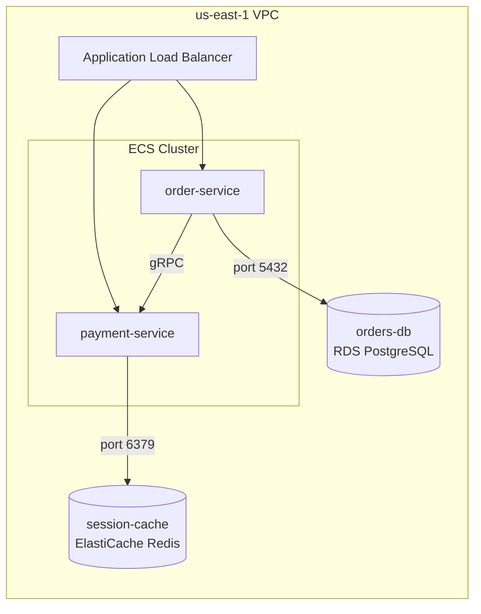

## File signatures
- `*.mmd`
- `*.mermaid`
- Markdown files (`.md`) containing ` ```mermaid ` fenced code blocks (extract only the fenced block content)

## Parsing method
Line-by-line text parsing of Mermaid diagram syntax.

1. **Diagram type**: first non-comment line declares the type. Relevant types: `flowchart`, `graph` (alias for flowchart), `C4Context`, `C4Container`, `C4Deployment`. Skip: `sequenceDiagram`, `classDiagram`, `gantt`, `pie`, `gitgraph`, `erDiagram`, `journey`, `stateDiagram`.
2. **Nodes**: declared as `nodeId[Label]`, `nodeId(Label)`, `nodeId{Label}`, `nodeId[(Label)]` (cylinder = database), `nodeId[[Label]]`, `nodeId>Label]`, `nodeId{{Label}}`. The shape hint matters — cylinders suggest databases, hexagons suggest external services.
3. **Edges**: declared as `-->`, `---`, `-.->`, `==>`, with optional labels `-->|label|` or `-- label -->`. Extract source node, target node, and edge label.
4. **Subgraphs**: `subgraph Title` ... `end` blocks. These may represent service boundaries, regions, or logical groupings. Subgraphs can nest.

## What to extract
- **Resource types**: from node shapes (cylinder = database), labels containing resource type keywords (e.g., "RDS", "Redis", "ALB"), and subgraph titles
- **Resource names**: from node labels (prefer label over node ID; IDs are often shorthand)
- **Relationships**: from edges between nodes, with edge labels providing relationship context (e.g., "reads from", "port 5432")
- **Service boundaries**: from subgraph groupings
- **Cloud context**: from subgraph titles or node labels containing region names, account references, or cloud provider names

## Extraction examples

**Raw Mermaid:**



**Extracted hints:**

- Resource: type=ALB, name="Application Load Balancer"
- Resource: type=ECS Service, name="order-service" (inside ECS Cluster subgraph)
- Resource: type=ECS Service, name="payment-service" (inside ECS Cluster subgraph)
- Resource: type=RDS, name="orders-db", engine=PostgreSQL (cylinder shape + label)
- Resource: type=ElastiCache, name="session-cache", engine=Redis (cylinder shape + label)
- Relationship: ALB → order-service
- Relationship: ALB → payment-service
- Relationship: order-service → orders-db (port 5432)
- Relationship: payment-service → session-cache (port 6379)
- Relationship: order-service → payment-service (gRPC)
- Context: region=us-east-1, boundary=VPC, boundary=ECS Cluster

## Limitations
- **Node ID vs label mismatch**: node IDs (e.g., `SvcA`) are programmer shorthand and may not appear in infrastructure; always prefer the label text
- **Embedded in markdown**: when Mermaid is inside a `.md` file, only extract from ` ```mermaid ` blocks; ignore surrounding prose (the `markdown.md` detector handles that)
- **Irrelevant diagram types**: sequence, class, Gantt, ER, and state diagrams rarely contain infrastructure topology; skip them to avoid false positives
- **No standard cloud shapes**: Mermaid has no built-in AWS/GCP/Azure shape library, so resource types come entirely from label text — lower confidence than draw.io stencils
- **Direction declarations**: `LR`, `TB`, `RL`, `BT` are layout hints, not semantic content; ignore them
